# Interesting resources related to XAI (Explainable Artificial Intelligence)

* [Papers and preprints in scientific journals](README.md#papers)
* [Books and longer materials](README.md#books)
* [Software tools](README.md#tools)
* [Short articles in newspapers](README.md#articles)
* [Misc](README.md#theses)

## Papers

### 2020

* [A Performance-Explainability Framework to Benchmark Machine Learning Methods: Application to Multivariate Time Series Classifiers](https://arxiv.org/abs/2005.14501); Kevin Fauvel, Véronique Masson, Élisa Fromont; Our research aims to propose a new performance-explainability analytical framework to assess and benchmark machine learning methods. The framework details a set of characteristics that operationalize the performance-explainability assessment of existing machine learning methods. In order to illustrate the use of the framework, we apply it to benchmark the current state-of-the-art multivariate time series classifiers.

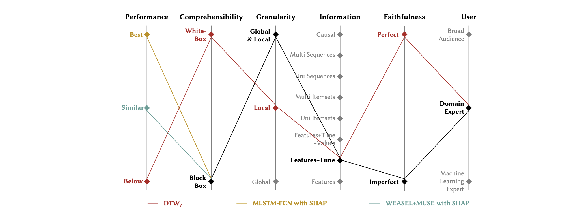

* [EXPLAN: Explaining Black-box Classifiers using Adaptive Neighborhood Generation](https://ieeexplore.ieee.org/document/9206710); Peyman Rasouli and Ingrid Chieh Yu; Defining a representative locality is an urgent challenge in perturbation-based explanation methods, which influences the fidelity and soundness of explanations. We address this issue by proposing a robust and intuitive approach for EXPLaining black-box classifiers using Adaptive Neighborhood generation (EXPLAN). EXPLAN is a module-based algorithm consisted of dense data generation, representative data selection, data balancing, and rule-based interpretable model. It takes into account the adjacency information derived from the black-box decision function and the structure of the data for creating a representative neighborhood for the instance being explained. As a local model-agnostic explanation method, EXPLAN generates explanations in the form of logical rules that are highly interpretable and well-suited for qualitative analysis of the model's behavior. We discuss fidelity-interpretability trade-offs and demonstrate the performance of the proposed algorithm by a comprehensive comparison with state-of-the-art explanation methods LIME, LORE, and Anchor. The conducted experiments on real-world data sets show our method achieves solid empirical results in terms of fidelity, precision, and stability of explanations. [[Paper]](https://ieeexplore.ieee.org/document/9206710) [[Github]](https://github.com/peymanras/EXPLAN)

* [GRACE: Generating Concise and Informative Contrastive Sample to Explain Neural Network Model's Prediction](https://arxiv.org/abs/1911.02042); Thai Le, Suhang Wang, Dongwon Lee; Despite the recent development in the topic of explainable AI/ML for image and text data, the majority of current solutions are not suitable to explain the prediction of neural network models when the datasets are tabular and their features are in high-dimensional vectorized formats. To mitigate this limitation, therefore, we borrow two notable ideas (i.e., "explanation by intervention" from causality and "explanation are contrastive" from philosophy) and propose a novel solution, named as GRACE, that better explains neural network models' predictions for tabular datasets. In particular, given a model's prediction as label X, GRACE intervenes and generates a minimally-modified contrastive sample to be classified as Y, with an intuitive textual explanation, answering the question of "Why X rather than Y?" We carry out comprehensive experiments using eleven public datasets of different scales and domains (e.g., # of features ranges from 5 to 216) and compare GRACE with competing baselines on different measures: fidelity, conciseness, info-gain, and influence. The user-studies show that our generated explanation is not only more intuitive and easy-to-understand but also facilitates end-users to make as much as 60% more accurate post-explanation decisions than that of Lime.

* [ExplainExplore: Visual Exploration of Machine Learning Explanation](https://research.tue.nl/files/170065756/09086281.pdf); Dennis Collaris, Jack J. van Wijk; Machine learning models often exhibit complex behavior that is difficult to understand. Recent research in explainable AI has produced promising techniques to explain the inner workings of such models using feature contribution vectors. These vectors are helpful in a wide variety of applications. However, there are many parameters involved in this process and determining which settings are best is difficult due to the subjective nature of evaluating interpretability. To this end, we introduce ExplainExplore: an interactive explanation system to explore explanations that fit the subjective preference of data scientists. We leverage the domain knowledge of the data scientist to find optimal parameter settings and instance perturbations, and enable the discussion of the model and its explanation with domain experts. We present a use case on a real-world dataset to demonstrate the effectiveness of our approach for the exploration and tuning of machine learning explanations. [[website]](https://explaining.ml)

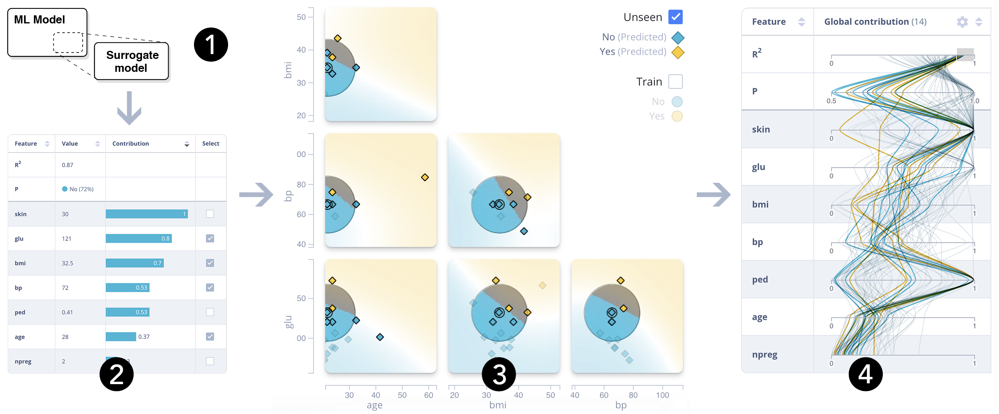

* [FACE: Feasible and Actionable Counterfactual Explanations](https://arxiv.org/abs/1909.09369); Rafael Poyiadzi, Kacper Sokol, Raul Santos-Rodriguez, Tijl De Bie, Peter Flach; Work in Counterfactual Explanations tends to focus on the principle of "the closest possible world" that identifies small changes leading to the desired outcome. In this paper we argue that while this approach might initially seem intuitively appealing it exhibits shortcomings not addressed in the current literature. First, a counterfactual example generated by the state-of-the-art systems is not necessarily representative of the underlying data distribution, and may therefore prescribe unachievable goals(e.g., an unsuccessful life insurance applicant with severe disability may be advised to do more sports). Secondly, the counterfactuals may not be based on a "feasible path" between the current state of the subject and the suggested one, making actionable recourse infeasible (e.g., low-skilled unsuccessful mortgage applicants may be told to double their salary, which may be hard without first increasing their skill level). 

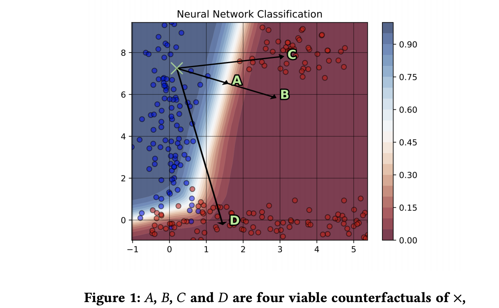

* [Explainability Fact Sheets: A Framework for Systematic Assessment of Explainable Approaches](https://arxiv.org/abs/1912.05100); Kacper Sokol, Peter Flach; Explanations in Machine Learning come in many forms, but a consensus regarding their desired properties is yet to emerge. In this paper we introduce a taxonomy and a set of descriptors that can be used to characterise and systematically assess explainable systems along five key dimensions: functional, operational, usability, safety and validation. In order to design a comprehensive and representative taxonomy and associated descriptors we surveyed the eXplainable Artificial Intelligence literature, extracting the criteria and desiderata that other authors have proposed or implicitly used in their research. The survey includes papers introducing new explainability algorithms to see what criteria are used to guide their development and how these algorithms are evaluated, as well as papers proposing such criteria from both computer science and social science perspectives. This novel framework allows to systematically compare and contrast explainability approaches, not just to better understand their capabilities but also to identify discrepancies between their theoretical qualities and properties of their implementations. We developed an operationalisation of the framework in the form of Explainability Fact Sheets, which enable researchers and practitioners alike to quickly grasp capabilities and limitations of a particular explainable method. 

* [One Explanation Does Not Fit All: The Promise of Interactive Explanations for Machine Learning Transparency](https://arxiv.org/abs/2001.09734); Kacper Sokol, Peter Flach; The need for transparency of predictive systems based on Machine Learning algorithms arises as a consequence of their ever-increasing proliferation in the industry. Whenever black-box algorithmic predictions influence human affairs, the inner workings of these algorithms should be scrutinised and their decisions explained to the relevant stakeholders, including the system engineers, the system's operators and the individuals whose case is being decided. While a variety of interpretability and explainability methods is available, none of them is a panacea that can satisfy all diverse expectations and competing objectives that might be required by the parties involved. We address this challenge in this paper by discussing the promises of Interactive Machine Learning for improved transparency of black-box systems using the example of contrastive explanations -- a state-of-the-art approach to Interpretable Machine Learning. Specifically, we show how to personalise counterfactual explanations by interactively adjusting their conditional statements and extract additional explanations by asking follow-up "What if?" questions.

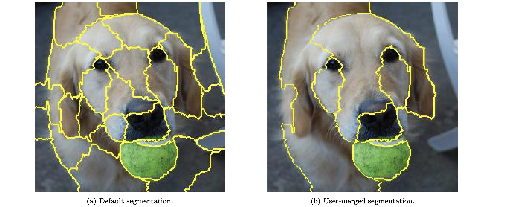

* [FAT Forensics: A Python Toolbox for Algorithmic Fairness, Accountability and Transparency](https://arxiv.org/abs/1909.05167); Kacper Sokol, Raul Santos-Rodriguez, Peter Flach; Given the potential harm that ML algorithms can cause, qualities such as fairness, accountability and transparency of predictive systems are of paramount importance. Recent literature suggested voluntary self-reporting on these aspects of predictive systems -- e.g., data sheets for data sets -- but their scope is often limited to a single component of a machine learning pipeline, and producing them requires manual labour. To resolve this impasse and ensure high-quality, fair, transparent and reliable machine learning systems, we developed an open source toolbox that can inspect selected fairness, accountability and transparency aspects of these systems to automatically and objectively report them back to their engineers and users. We describe design, scope and usage examples of this Python toolbox in this paper. The toolbox provides functionality for inspecting fairness, accountability and transparency of all aspects of the machine learning process: data (and their features), models and predictions.

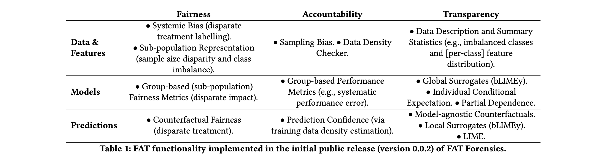

* [Adaptive Explainable Neural Networks (AxNNs)](https://arxiv.org/abs/2004.02353); Jie Chen, Joel Vaughan, Vijayan Nair, Agus Sudjianto; While machine learning techniques have been successfully applied in several fields, the black-box nature of the models presents challenges for interpreting and explaining the results. We develop a new framework called Adaptive Explainable Neural Networks (AxNN) for achieving the dual goals of good predictive performance and model interpretability. For predictive performance, we build a structured neural network made up of ensembles of generalized additive model networks and additive index models (through explainable neural networks) using a two-stage process. This can be done using either a boosting or a stacking ensemble. For interpretability, we show how to decompose the results of AxNN into main effects and higher-order interaction effects. 

* [Information Leakage in Embedding Models](https://arxiv.org/abs/2004.00053); Congzheng Song, Ananth Raghunathan; We demonstrate that embeddings, in addition to encoding generic semantics, often also present a vector that leaks sensitive information about the input data. We develop three classes of attacks to systematically study information that might be leaked by embeddings. First, embedding vectors can be inverted to partially recover some of the input data. Second, embeddings may reveal sensitive attributes inherent in inputs and independent of the underlying semantic task at hand. Third, embedding models leak moderate amount of membership information for infrequent training data inputs. We extensively evaluate our attacks on various state-of-the-art embedding models in the text domain. We also propose and evaluate defenses that can prevent the leakage to some extent at a minor cost in utility.

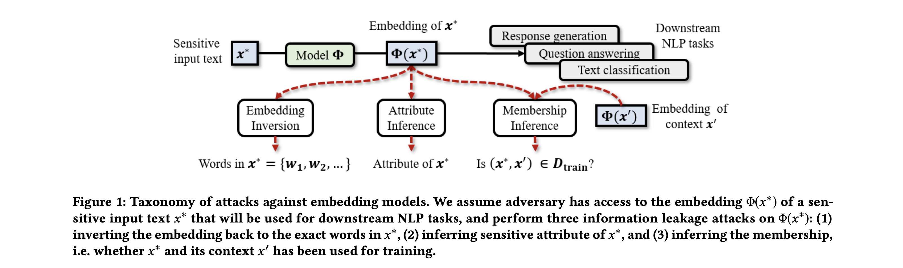

* [Closing the AI Accountability Gap: Defining an End-to-End Framework for Internal Algorithmic Auditing](https://arxiv.org/abs/2001.00973); Inioluwa Deborah Raji, et. al. Rising concern for the societal implications of artificial intelligence systems has inspired a wave of academic and journalistic literature in which deployed systems are audited for harm by investigators from outside the organizations deploying the algorithms. However, it remains challenging for practitioners to identify the harmful repercussions of their own systems prior to deployment, and, once deployed, emergent issues can become difficult or impossible to trace back to their source. In this paper, we introduce a framework for algorithmic auditing that supports artificial intelligence system development end-to-end, to be applied throughout the internal organization development lifecycle. Each stage of the audit yields a set of documents that together form an overall audit report, drawing on an organization's values or principles to assess the fit of decisions made throughout the process. 

* [Explaining the Explainer: A First Theoretical Analysis of LIME](https://arxiv.org/abs/2001.03447); Damien Garreau, Ulrike von Luxburg; Machine learning is used more and more often for sensitive applications, sometimes replacing humans in critical decision-making processes. As such, interpretability of these algorithms is a pressing need. One popular algorithm to provide interpretability is LIME (Local Interpretable Model-Agnostic Explanation). In this paper, we provide the first theoretical analysis of LIME. We derive closed-form expressions for the coefficients of the interpretable model when the function to explain is linear. The good news is that these coefficients are proportional to the gradient of the function to explain: LIME indeed discovers meaningful features. However, our analysis also reveals that poor choices of parameters can lead LIME to miss important features. 

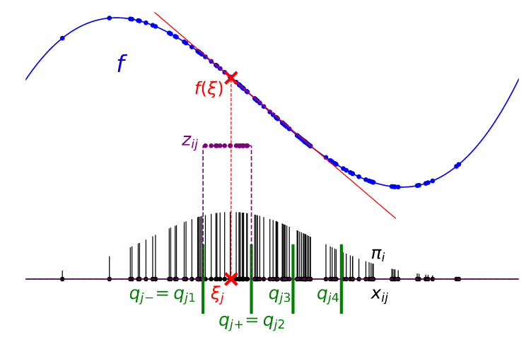

### 2019

* [bLIMEy: Surrogate Prediction Explanations Beyond LIME?](https://arxiv.org/pdf/1910.13016.pdf); Kacper Sokol, Alexander Hepburn, Raul Santos-Rodriguez, Peter Flach. Surrogate explainers of black-box machine learning predictions are of paramount importance in the field of eXplainable Artificial Intelligence since they can be applied to any type of data (images, text and tabular), are model-agnostic and are post-hoc (i.e., can be retrofitted). The Local Interpretable Model-agnostic Explanations (LIME) algorithm is often mistakenly unified with a more general framework of surrogate explainers, which may lead to a belief that it is the solution to surrogate explainability. In this paper we empower the community to "build LIME yourself" (bLIMEy) by proposing a principled algorithmic framework for building custom local surrogate explainers of black-box model predictions, including LIME itself. To this end, we demonstrate how to decompose the surrogate explainers family into algorithmically independent and interoperable modules and discuss the influence of these component choices on the functional capabilities of the resulting explainer, using the example of LIME.

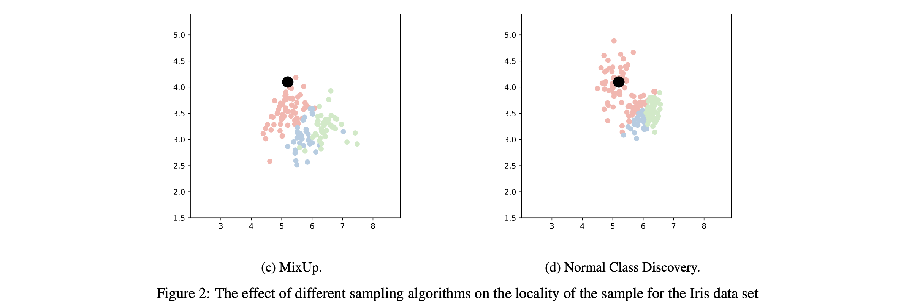

* [Are Sixteen Heads Really Better than One?](https://arxiv.org/abs/1905.10650); Paul Michel, Omer Levy, Graham Neubig. Attention is a powerful and ubiquitous mechanism for allowing neural models to focus on particular salient pieces of information by taking their weighted average when making predictions. In particular, multi-headed attention is a driving force behind many recent state-of-the-art NLP models such as Transformer-based MT models and BERT. In this paper we make the surprising observation that even if models have been trained using multiple heads, in practice, a large percentage of attention heads can be removed at test time without significantly impacting performance. In fact, some layers can even be reduced to a single head. We further examine greedy algorithms for pruning down models, and the potential speed, memory efficiency, and accuracy improvements obtainable therefrom. 

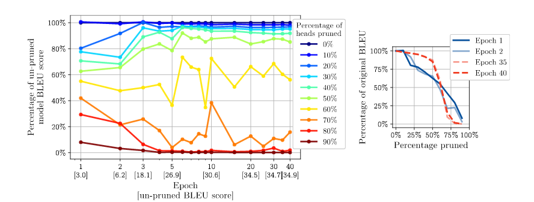

* [Revealing the Dark Secrets of BERT](https://arxiv.org/abs/1908.08593); Olga Kovaleva, Alexey Romanov, Anna Rogers, Anna Rumshisky. BERT-based architectures currently give state-of-the-art performance on many NLP tasks, but little is known about the exact mechanisms that contribute to its success. In the current work, we focus on the interpretation of self-attention, which is one of the fundamental underlying components of BERT. Using a subset of GLUE tasks and a set of handcrafted features-of-interest, we propose the methodology and carry out a qualitative and quantitative analysis of the information encoded by the individual BERT's heads. Our findings suggest that there is a limited set of attention patterns that are repeated across different heads, indicating the overall model overparametrization. While different heads consistently use the same attention patterns, they have varying impact on performance across different tasks. We show that manually disabling attention in certain heads leads to a performance improvement over the regular fine-tuned BERT models.

* [Explanation in Artificial Intelligence:Insights from the Social Sciences](https://arxiv.org/pdf/1706.07269.pdf); Tim Miller. There has been a recent resurgence in the area of explainable artificial intelligence as researchers and practitioners seek to make their algorithms more understandable. Much of this research is focused on explicitly explaining decisions or actions to a human observer, and it should not be controversial to say that looking at how humans explain to each other can serve as a useful starting point for explanation in artificial intelligence. However, it is fair to say that most work in explainable artificial intelligence uses only the researchers' intuition of what constitutes a `good' explanation. There exists vast and valuable bodies of research in philosophy, psychology, and cognitive science of how people define, generate, select, evaluate, and present explanations, which argues that people employ certain cognitive biases and social expectations towards the explanation process. This paper argues that the field of explainable artificial intelligence should build on this existing research, and reviews relevant papers from philosophy, cognitive psychology/science, and social psychology, which study these topics. 

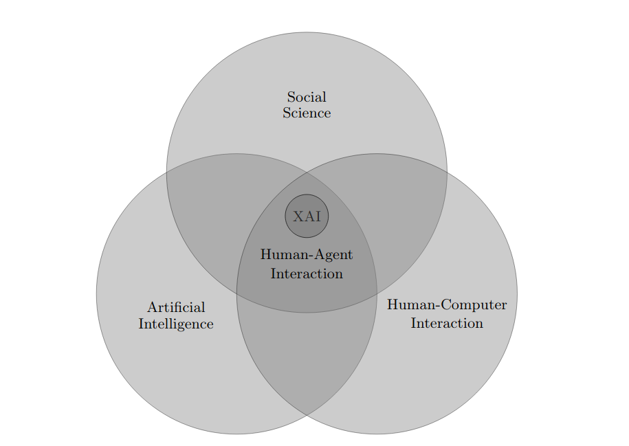

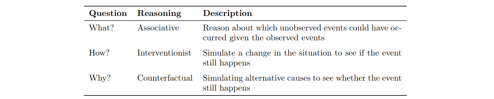

* [AnchorViz: Facilitating Semantic Data Exploration and Concept Discovery for Interactive Machine Learning](https://www.microsoft.com/en-us/research/publication/anchorviz-facilitating-semantic-data-exploration-and-concept-discovery-for-interactive-machine-learning/); Jina Suh et. al., When building a classifier in interactive machine learning (iML), human knowledge about the target class can be a powerful reference to make the classifier robust to unseen items. The main challenge lies in finding unlabeled items that can either help discover or refine concepts for which the current classifier has no corresponding features (i.e., it has feature blindness). Yet it is unrealistic to ask humans to come up with an exhaustive list of items, especially for rare concepts that are hard to recall. This article presents AnchorViz, an interactive visualization that facilitates the discovery of prediction errors and previously unseen concepts through human-driven semantic data exploration.

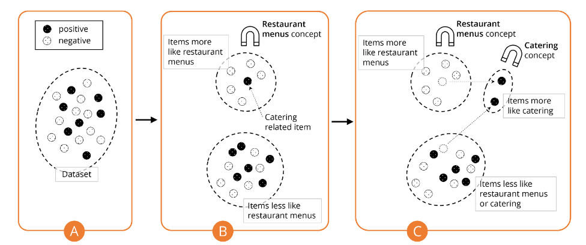

* [Randomized Ablation Feature Importance](https://arxiv.org/abs/1910.00174); Luke Merrick; Given a model f that predicts a target y from a vector of input features x=x1,x2,…,xM, we seek to measure the importance of each feature with respect to the model's ability to make a good prediction. To this end, we consider how (on average) some measure of goodness or badness of prediction (which we term "loss"), changes when we hide or ablate each feature from the model. To ablate a feature, we replace its value with another possible value randomly. By averaging over many points and many possible replacements, we measure the importance of a feature on the model's ability to make good predictions. Furthermore, we present statistical measures of uncertainty that quantify how confident we are that the feature importance we measure from our finite dataset and finite number of ablations is close to the theoretical true importance value. 

* [Explainable AI for Trees: From Local Explanations to Global Understanding](https://arxiv.org/abs/1905.04610); Scott M. Lundberg, Gabriel Erion, Hugh Chen, Alex DeGrave, Jordan M. Prutkin, Bala Nair, Ronit Katz, Jonathan Himmelfarb, Nisha Bansal, Su-In Lee; Tree-based machine learning models such as random forests, decision trees, and gradient boosted trees are the most popular non-linear predictive models used in practice today, yet comparatively little attention has been paid to explaining their predictions. Here we significantly improve the interpretability of tree-based models through three main contributions: 1) The first polynomial time algorithm to compute optimal explanations based on game theory. 2) A new type of explanation that directly measures local feature interaction effects. 3) A new set of tools for understanding global model structure based on combining many local explanations of each prediction. We apply these tools to three medical machine learning problems and show how combining many high-quality local explanations allows us to represent global structure while retaining local faithfulness to the original model. These tools enable us to i) identify high magnitude but low frequency non-linear mortality risk factors in the general US population, ii) highlight distinct population sub-groups with shared risk characteristics, iii) identify non-linear interaction effects among risk factors for chronic kidney disease, and iv) monitor a machine learning model deployed in a hospital by identifying which features are degrading the model's performance over time. Given the popularity of tree-based machine learning models, these improvements to their interpretability have implications across a broad set of domains. [GitHub](https://github.com/suinleelab/treeexplainer-study)

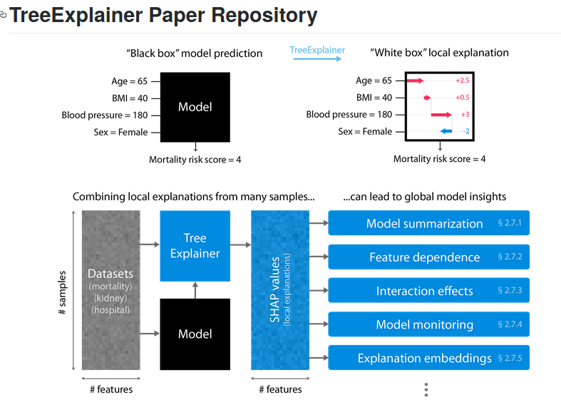

* [One Explanation Does Not Fit All: A Toolkit and Taxonomy of AI Explainability Techniques](https://arxiv.org/abs/1909.03012); Vijay Arya, Rachel K. E. Bellamy, Pin-Yu Chen, Amit Dhurandhar, Michael Hind, Samuel C. Hoffman, Stephanie Houde, Q. Vera Liao, Ronny Luss, Aleksandra Mojsilović, Sami Mourad, Pablo Pedemonte, Ramya Raghavendra, John Richards, Prasanna Sattigeri, Karthikeyan Shanmugam, Moninder Singh, Kush R. Varshney, Dennis Wei, Yunfeng Zhang; 
As artificial intelligence and machine learning algorithms make further inroads into society, calls are increasing from multiple stakeholders for these algorithms to explain their outputs. At the same time, these stakeholders, whether they be affected citizens, government regulators, domain experts, or system developers, present different requirements for explanations. Toward addressing these needs, we introduce AI Explainability 360 (this http URL), an open-source software toolkit featuring eight diverse and state-of-the-art explainability methods and two evaluation metrics. Equally important, we provide a taxonomy to help entities requiring explanations to navigate the space of explanation methods, not only those in the toolkit but also in the broader literature on explainability. For data scientists and other users of the toolkit, we have implemented an extensible software architecture that organizes methods according to their place in the AI modeling pipeline. We also discuss enhancements to bring research innovations closer to consumers of explanations, ranging from simplified, more accessible versions of algorithms, to tutorials and an interactive web demo to introduce AI explainability to different audiences and application domains. Together, our toolkit and taxonomy can help identify gaps where more explainability methods are needed and provide a platform to incorporate them as they are developed. 
[GitHub](https://github.com/IBM/AIX360); [Demo](http://aix360.mybluemix.net/data)

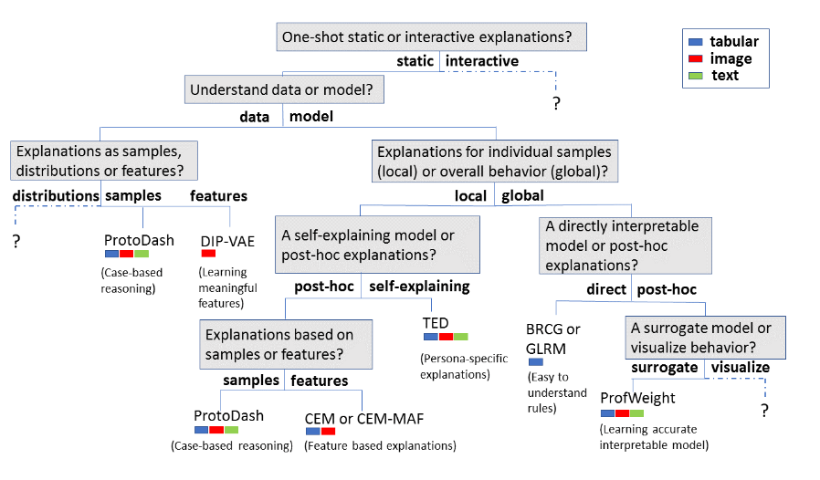

* [LIRME: Locally Interpretable Ranking Model Explanation](https://dl.acm.org/doi/10.1145/3331184.3331377); Manisha Verma, Debasis Ganguly; Information retrieval (IR) models often employ complex variations in term weights to compute an aggregated similarity score of a query-document pair. Treating IR models as black-boxes makes it difficult to understand or explain why certain documents are retrieved at top-ranks for a given query. Local explanation models have emerged as a popular means to understand individual predictions of classification models. However, there is no systematic investigation that learns to interpret IR models, which is in fact the core contribution of our work in this paper. We explore three sampling methods to train an explanation model and propose two metrics to evaluate explanations generated for an IR model. Our experiments reveal some interesting observations, namely that a) diversity in samples is important for training local explanation models, and b) the stability of a model is inversely proportional to the number of parameters used to explain the model.

* [Understanding complex predictive models with Ghost Variables](https://arxiv.org/abs/1912.06407); Pedro Delicado, Daniel Peña; Procedure for assigning a relevance measure to each explanatory variable in a complex predictive model. We assume that we have a training set to fit the model and a test set to check the out of sample performance. First, the individual relevance of each variable is computed by comparing the predictions in the test set, given by the model that includes all the variables with those of another model in which the variable of interest is substituted by its ghost variable, defined as the prediction of this variable by using the rest of explanatory variables. Second, we check the joint effects among the variables by using the eigenvalues of a relevance matrix that is the covariance matrix of the vectors of individual effects. It is shown that in simple models, as linear or additive models, the proposed measures are related to standard measures of significance of the variables and in neural networks models (and in other algorithmic prediction models) the procedure provides information about the joint and individual effects of the variables that is not usually available by other methods.

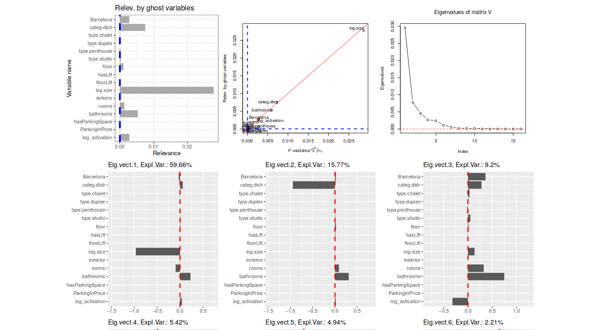

* [Unmasking Clever Hans predictors and assessing what machines really learn](https://www.nature.com/articles/s41467-019-08987-4); Sebastian Lapuschkin, Stephan Wäldchen, Alexander Binder, Grégoire Montavon, Wojciech Samek, Klaus-Robert Müller; Current learning machines have successfully solved hard application problems, reaching high accuracy and displaying seemingly intelligent behavior. Here we apply recent techniques for explaining decisions of state-of-the-art learning machines and analyze various tasks from computer vision and arcade games. This showcases a spectrum of problem-solving behaviors ranging from naive and short-sighted, to well-informed and strategic. We observe that standard performance evaluation metrics can be oblivious to distinguishing these diverse problem solving behaviors. Furthermore, we propose our semi-automated Spectral Relevance Analysis that provides a practically effective way of characterizing and validating the behavior of nonlinear learning machines. This helps to assess whether a learned model indeed delivers reliably for the problem that it was conceived for. Furthermore, our work intends to add a voice of caution to the ongoing excitement about machine intelligence and pledges to evaluate and judge some of these recent successes in a more nuanced manner.

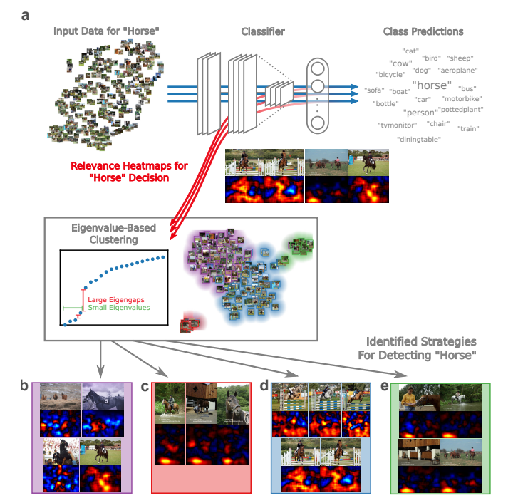

* [Feature Impact for Prediction Explanation](https://www.researchgate.net/publication/335189270_Feature_Impact_for_Prediction_Explanation); Mohammad Bataineh; Companies across the globe have been adapting complex Machine Learning (ML) techniques to build advanced predictive models to improve their operations and services and help in decision making. While these ML techniques are extremely powerful and have found success in different industries for helping with decision making, a common feedback heard across many industries worldwide is that too often these techniques are opaque in nature with no details as to why a particular prediction probability was reached. T his work presents an innovative algorithm that addresses this limitation by providing a ranked list of all features according to their contribution to a model's prediction. T his new algorithm, Feature Impact for Prediction Explanation (FIPE), incorporates individual feature variations and correlations to calculate feature imp act for a prediction. T he true power of FIPE lies in its computationally-efficient ability to provide feature impact irrespective of the base ML technique used.

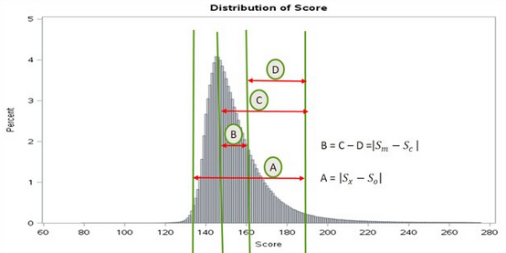

* [Relative Attributing Propagation: Interpreting the Comparative Contributions of Individual Units in Deep Neural Networks](https://arxiv.org/abs/1904.00605); Woo-Jeoung Nam, Shir Gur, Jaesik Choi, Lior Wolf, Seong-Whan Lee; As Deep Neural Networks (DNNs) have demonstrated superhuman performance in a variety of fields, there is an increasing interest in understanding the complex internal mechanisms of DNNs. In this paper, we propose Relative Attributing Propagation (RAP), which decomposes the output predictions of DNNs with a new perspective of separating the relevant (positive) and irrelevant (negative) attributions according to the relative influence between the layers. The relevance of each neuron is identified with respect to its degree of contribution, separated into positive and negative, while preserving the conservation rule. Considering the relevance assigned to neurons in terms of relative priority, RAP allows each neuron to be assigned with a bi-polar importance score concerning the output: from highly relevant to highly irrelevant. Therefore, our method makes it possible to interpret DNNs with much clearer and attentive visualizations of the separated attributions than the conventional explaining methods. To verify that the attributions propagated by RAP correctly account for each meaning, we utilize the evaluation metrics: (i) Outside-inside relevance ratio, (ii) Segmentation mIOU and (iii) Region perturbation. In all experiments and metrics, we present a sizable gap in comparison to the existing literature.

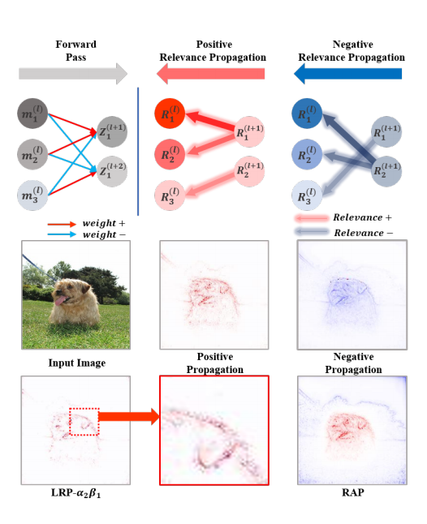

* [The Bouncer Problem: Challenges to Remote Explainability](https://arxiv.org/abs/1910.01432v1); Erwan Le Merrer, Gilles Tredan; The concept of explainability is envisioned to satisfy society's demands for transparency on machine learning decisions. The concept is simple: like humans, algorithms should explain the rationale behind their decisions so that their fairness can be assessed. While this approach is promising in a local context (e.g. to explain a model during debugging at training time), we argue that this reasoning cannot simply be transposed in a remote context, where a trained model by a service provider is only accessible through its API. This is problematic as it constitutes precisely the target use-case requiring transparency from a societal perspective. Through an analogy with a club bouncer (which may provide untruthful explanations upon customer reject), we show that providing explanations cannot prevent a remote service from lying about the true reasons leading to its decisions. More precisely, we prove the impossibility of remote explainability for single explanations, by constructing an attack on explanations that hides discriminatory features to the querying user. We provide an example implementation of this attack. We then show that the probability that an observer spots the attack, using several explanations for attempting to find incoherences, is low in practical settings. This undermines the very concept of remote explainability in general. 

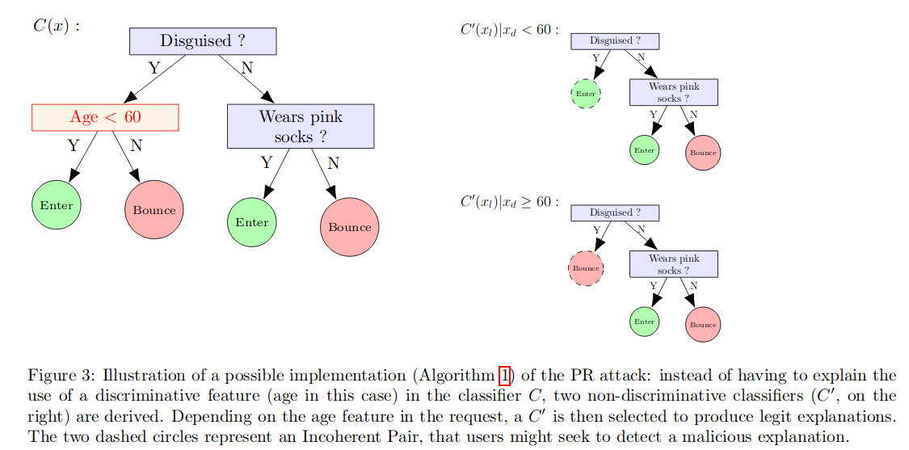

* [Understanding Black-box Predictions via Influence Functions](https://arxiv.org/abs/1703.04730); Pang Wei Koh, Percy Liang;  How can we explain the predictions of a black-box model? In this paper, we use influence functions -- a classic technique from robust statistics -- to trace a model's prediction through the learning algorithm and back to its training data, thereby identifying training points most responsible for a given prediction. To scale up influence functions to modern machine learning settings, we develop a simple, efficient implementation that requires only oracle access to gradients and Hessian-vector products. We show that even on non-convex and non-differentiable models where the theory breaks down, approximations to influence functions can still provide valuable information. On linear models and convolutional neural networks, we demonstrate that influence functions are useful for multiple purposes: understanding model behavior, debugging models, detecting dataset errors, and even creating visually-indistinguishable training-set attacks. 

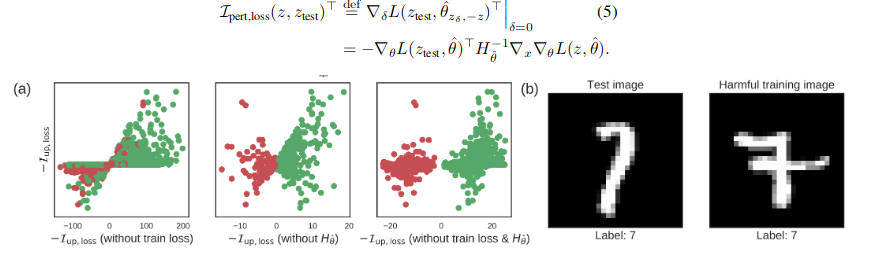

* [Towards XAI: Structuringthe Processes of Explanations](https://www.researchgate.net/profile/Mennatallah_El-Assady/publication/332802468_Towards_XAI_Structuring_the_Processes_of_Explanations/links/5ccad56b92851c8d22146613/Towards-XAI-Structuring-the-Processes-of-Explanations.pdf); Mennatallah El-Assady, et al; Explainable Artificial Intelligence describes aprocessto reveal the logical propagation of operationsthat transform a given input to a certain output. In this paper, we investigate the design space ofexplanation processes based on factors gathered from six research areas, namely, Pedagogy, Story-telling, Argumentation, Programming, Trust-Building, and Gamification. We contribute a conceptualmodel describing the building blocks of explanation processes, including a comprehensive overview ofexplanation and verification phases, pathways, mediums, and strategies. We further argue for theimportance of studying effective methods of explainable machine learning, and discuss open researchchallenges and opportunities.

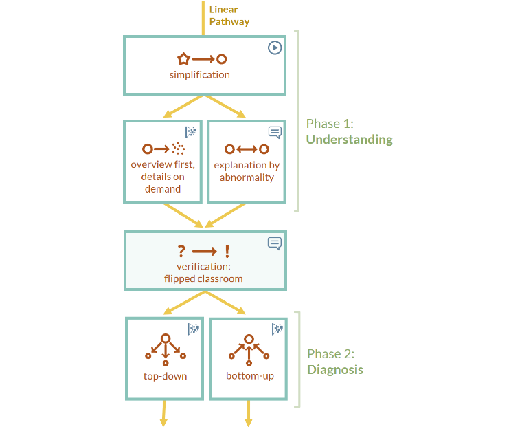

* [Towards Automated Machine Learning: Evaluation and Comparison of AutoML Approaches and Tools](https://arxiv.org/abs/1908.05557); Anh Truong, Austin Walters, Jeremy Goodsitt, Keegan Hines, C. Bayan Bruss, Reza Farivar; There has been considerable growth and interest in industrial applications of machine learning (ML) in recent years. ML engineers, as a consequence, are in high demand across the industry, yet improving the efficiency of ML engineers remains a fundamental challenge. Automated machine learning (AutoML) has emerged as a way to save time and effort on repetitive tasks in ML pipelines, such as data pre-processing, feature engineering, model selection, hyperparameter optimization, and prediction result analysis. In this paper, we investigate the current state of AutoML tools aiming to automate these tasks. We conduct various evaluations of the tools on many datasets, in different data segments, to examine their performance, and compare their advantages and disadvantages on different test cases. 

* [Intelligible Models for HealthCare: Predicting PneumoniaRisk and Hospital 30-day Readmission](https://www.microsoft.com/en-us/research/wp-content/uploads/2017/06/KDD2015FinalDraftIntelligibleModels4HealthCare_igt143e-caruanaA.pdf); Rich Caruana et al;  In machine learning often a tradeoff must be made betweenaccuracy and intelligibility.  More accurate models such as boosted trees,  random forests,  and neural nets usually arenot intelligible, but more intelligible models such as logistic regression, naive-Bayes, and single decision trees often havesignificantly worse accuracy.  This tradeoff sometimes limits the accuracy of models that can be applied in mission-criticalapplications such as healthcare where being able to under-stand, validate, edit, and trust a learned model is important.We present two case studies where high-performance gener-alized additive models with pairwise interactions (GA2Ms) are applied to real healthcare problems yielding intelligiblemodels  with  state-of-the-art  accuracy.   In  the  pneumoniarisk  prediction  case  study,  the  intelligible  model  uncoverssurprising  patterns  in  the  data  that  previously  had  pre-vented  complex  learned  models  from  being  fielded  in  thisdomain,  but  because  it  is  intelligible  and  modular  allowsthese  patterns  to  be  recognized  and  removed.   In  the  30-day hospital readmission case study, we show that the samemethods scale to large datasets containing hundreds of thou-sands of patients and thousands of attributes while remaining  intelligible  and  providing  accuracy  comparable  to  the best (unintelligible) machine learning methods .

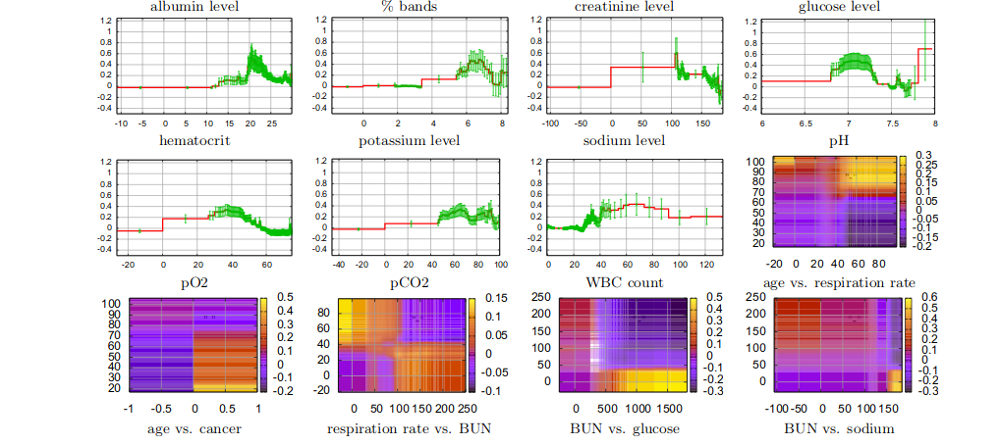

* [Shapley Decomposition of R-Squared in Machine Learning Models](https://arxiv.org/abs/1908.09718); Nickalus Redell; In this paper we introduce a metric aimed at helping machine learning practitioners quickly summarize and communicate the overall importance of each feature in any black-box machine learning prediction model. Our proposed metric, based on a Shapley-value variance decomposition of the familiar R2 from classical statistics, is a model-agnostic approach for assessing feature importance that fairly allocates the proportion of model-explained variability in the data to each model feature. This metric has several desirable properties including boundedness at 0 and 1 and a feature-level variance decomposition summing to the overall model R2. Our implementation is available in the R package shapFlex. 

* [Data Shapley: Equitable Valuation of Data for Machine Learning](https://arxiv.org/abs/1904.02868); Amirata Ghorbani, James Zou; As data becomes the fuel driving technological and economic growth, a fundamental challenge is how to quantify the value of data in algorithmic predictions and decisions. For example, in healthcare and consumer markets, it has been suggested that individuals should be compensated for the data that they generate, but it is not clear what is an equitable valuation for individual data. In this work, we develop a principled framework to address data valuation in the context of supervised machine learning. Given a learning algorithm trained on n data points to produce a predictor, we propose data Shapley as a metric to quantify the value of each training datum to the predictor performance. Data Shapley value uniquely satisfies several natural properties of equitable data valuation. We develop Monte Carlo and gradient-based methods to efficiently estimate data Shapley values in practical settings where complex learning algorithms, including neural networks, are trained on large datasets. In addition to being equitable, extensive experiments across biomedical, image and synthetic data demonstrate that data Shapley has several other benefits: 1) it is more powerful than the popular leave-one-out or leverage score in providing insight on what data is more valuable for a given learning task; 2) low Shapley value data effectively capture outliers and corruptions; 3) high Shapley value data inform what type of new data to acquire to improve the predictor. 

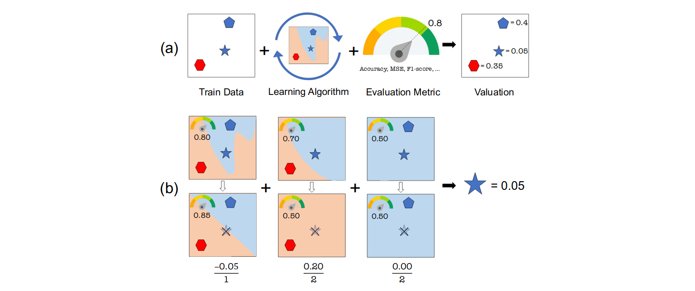

* [A Stratification Approach to Partial Dependence for Codependent Variables](https://arxiv.org/abs/1907.06698); Terence Parr, James Wilson;  Model interpretability is important to machine learning practitioners, and a key component of interpretation is the characterization of partial dependence of the response variable on any subset of features used in the model. The two most common strategies for assessing partial dependence suffer from a number of critical weaknesses. In the first strategy, linear regression model coefficients describe how a unit change in an explanatory variable changes the response, while holding other variables constant. But, linear regression is inapplicable for high dimensional (p>n) data sets and is often insufficient to capture the relationship between explanatory variables and the response. In the second strategy, Partial Dependence (PD) plots and Individual Conditional Expectation (ICE) plots give biased results for the common situation of codependent variables and they rely on fitted models provided by the user. When the supplied model is a poor choice due to systematic bias or overfitting, PD/ICE plots provide little (if any) useful information. To address these issues, we introduce a new strategy, called StratPD, that does not depend on a user's fitted model, provides accurate results in the presence codependent variables, and is applicable to high dimensional settings. The strategy works by stratifying a data set into groups of observations that are similar, except in the variable of interest, through the use of a decision tree. Any fluctuations of the response variable within a group is likely due to the variable of interest. We apply StratPD to a collection of simulations and case studies to show that StratPD is a fast, reliable, and robust method for assessing partial dependence with clear advantages over state-of-the-art methods. 

* [DLIME: A Deterministic Local Interpretable Model-Agnostic Explanations Approach for Computer-Aided Diagnosis Systems](https://arxiv.org/abs/1906.10263); Muhammad Rehman Zafar, Naimul Mefraz Khan;  While LIME and similar local algorithms have gained popularity due to their simplicity, the random perturbation and feature selection methods result in "instability" in the generated explanations, where for the same prediction, different explanations can be generated. This is a critical issue that can prevent deployment of LIME in a Computer-Aided Diagnosis (CAD) system, where stability is of utmost importance to earn the trust of medical professionals. In this paper, we propose a deterministic version of LIME. Instead of random perturbation, we utilize agglomerative Hierarchical Clustering (HC) to group the training data together and K-Nearest Neighbour (KNN) to select the relevant cluster of the new instance that is being explained. After finding the relevant cluster, a linear model is trained over the selected cluster to generate the explanations. Experimental results on three different medical datasets show the superiority for Deterministic Local Interpretable Model-Agnostic Explanations (DLIME), where we quantitatively determine the stability of DLIME compared to LIME utilizing the Jaccard similarity among multiple generated explanations.

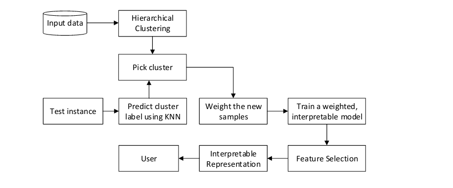

* [Exploiting patterns to explain individual predictions](https://people.eng.unimelb.edu.au/baileyj/papers/KAIS2019.pdf); Yunzhe Jia, James Bailey, Kotagiri Ramamohanarao, Christopher Leckie, Xingjun Ma;  Users  need  to  understand  the  predictions  of  a  classifier,  especially  when  decisions based on the predictions can have severe consequences. The explanation of a prediction reveals the reason why a classifier makes a certain prediction and it helps users to accept or reject the prediction with greater confidence. This paper proposes an explanation method called Pattern Aided Local  Explanation  (PALEX)  to  provide  instance-level  explanations  for  any  classifier.  PALEX takes a classifier, a test instance and a frequent pattern set summarizing the training data of the classifier as inputs, then outputs the supporting evidence that the classifier considers important for the prediction of the instance. To study the local behavior of a classifier in the vicinity of the test instance, PALEX uses the frequent pattern set from the training data as an extra input to guide generation of new synthetic samples in the vicinity of the test instance. Contrast patterns are also used in PALEX to identify locally discriminative features in the vicinity of a test instance. PALEXis particularly effective for scenarios where there exist multiple explanations.

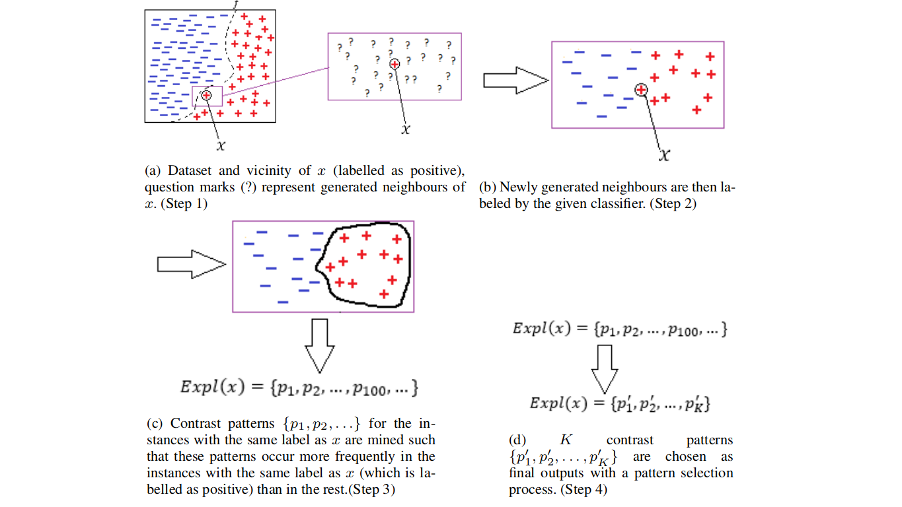

* [Fair is Better than Sensational:Man is to Doctor as Woman is to Doctor](https://arxiv.org/abs/1905.09866); Malvina Nissim, Rik van Noord, Rob van der Goot; Analogies such as man is to king as woman is to X are often used to illustrate the amazing power of word embeddings. Concurrently, they have also exposed how strongly human biases are encoded in vector spaces built on natural language. While finding that queen is the answer to man is to king as woman is to X leaves us in awe, papers have also reported finding analogies deeply infused with human biases, like man is to computer programmer as woman is to homemaker, which instead leave us with worry and rage. In this work we show that,often unknowingly, embedding spaces have not been treated fairly. Through a series of simple experiments, we highlight practical and theoretical problems in previous works, and demonstrate that some of the most widely used biased analogies are in fact not supported by the data. 

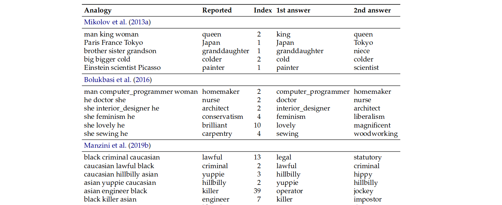

* [Interpretable Counterfactual Explanations Guided by Prototypes](https://arxiv.org/abs/1907.02584); Arnaud Van Looveren, Janis Klaise; We propose a fast, model agnostic method for finding interpretable counterfactual explanations of classifier predictions by using class prototypes. We show that class prototypes, obtained using either an encoder or through class specific k-d trees, significantly speed up the the search for counterfactual instances and result in more interpretable explanations. We introduce two novel metrics to quantitatively evaluate local interpretability at the instance level. We use these metrics to illustrate the effectiveness of our method on an image and tabular dataset, respectively MNIST and Breast Cancer Wisconsin (Diagnostic).
* [Learning Explainable Models Using Attribution Priors](https://arxiv.org/abs/1906.10670); Gabriel Erion, Joseph D. Janizek, Pascal Sturmfels, Scott Lundberg, Su-In Lee; Two important topics in deep learning both involve incorporating humans into the modeling process: Model priors transfer information from humans to a model by constraining the model's parameters; Model attributions transfer information from a model to humans by explaining the model's behavior. We propose connecting these topics with attribution priors, which allow humans to use the common language of attributions to enforce prior expectations about a model's behavior during training. We develop a differentiable axiomatic feature attribution method called expected gradients and show how to directly regularize these attributions during training. We demonstrate the broad applicability of attribution priors: 1) on image data, 2) on gene expression data, 3) on a health care dataset.  

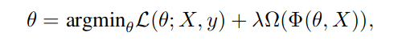

* [Guidelines for Responsible and Human-Centered Use of Explainable Machine Learning](https://arxiv.org/abs/1906.03533); Patrick Hall; Explainable machine learning (ML) has been implemented in numerous open source and proprietary software packages and explainable ML is an important aspect of commercial predictive modeling. However, explainable ML can be misused, particularly as a faulty safeguard for harmful black-boxes, e.g. fairwashing, and for other malevolent purposes like model stealing. This text discusses definitions, examples, and guidelines that promote a holistic and human-centered approach to ML which includes interpretable (i.e. white-box ) models and explanatory, debugging, and disparate impact analysis techniques. 

* [Concept Tree: High-Level Representation of Variables for More Interpretable Surrogate Decision Trees](https://arxiv.org/abs/1906.01297); Xavier Renard, Nicolas Woloszko, Jonathan Aigrain, Marcin Detyniecki; Interpretable surrogates of black-box predictors trained on high-dimensional tabular datasets can struggle to generate comprehensible explanations in the presence of correlated variables. We propose a model-agnostic interpretable surrogate that provides global and local explanations of black-box classifiers to address this issue. We introduce the idea of concepts as intuitive groupings of variables that are either defined by a domain expert or automatically discovered using correlation coefficients. Concepts are embedded in a surrogate decision tree to enhance its comprehensibility. 

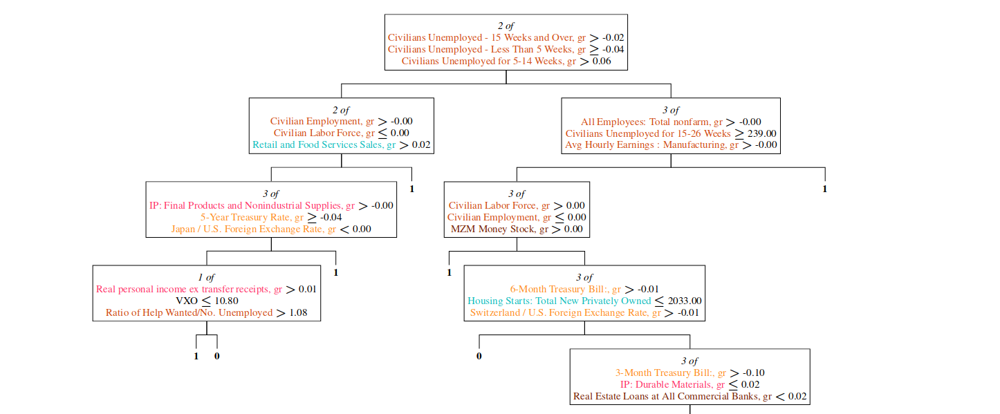

* [The Secrets of Machine Learning: Ten Things You Wish You Had Known Earlier to be More Effective at Data Analysis](https://arxiv.org/abs/1906.01998v1); Cynthia Rudin, David Carlson; Despite the widespread usage of machine learning throughout organizations, there are some key principles that are commonly missed. In particular: 1) There are at least four main families for supervised learning: logical modeling methods, linear combination methods, case-based reasoning methods, and iterative summarization methods. 2) For many application domains, almost all machine learning methods perform similarly (with some caveats). Deep learning methods, which are the leading technique for computer vision problems, do not maintain an edge over other methods for most problems (and there are reasons why). 3) Neural networks are hard to train and weird stuff often happens when you try to train them. 4) If you don't use an interpretable model, you can make bad mistakes. 5) Explanations can be misleading and you can't trust them. 6) You can pretty much always find an accurate-yet-interpretable model, even for deep neural networks. 7) Special properties such as decision making or robustness must be built in, they don't happen on their own. 8) Causal inference is different than prediction (correlation is not causation). 9) There is a method to the madness of deep neural architectures, but not always. 10) It is a myth that artificial intelligence can do anything. 

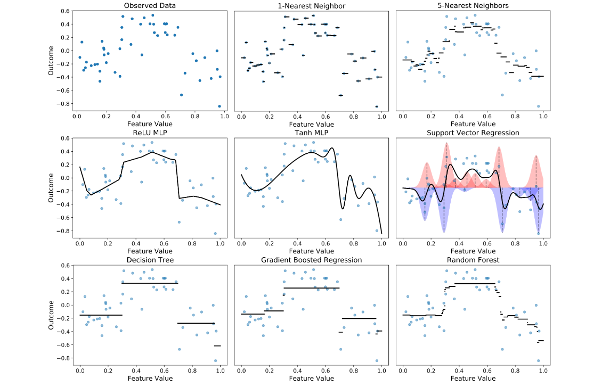

* [Proposals for model vulnerability and security](https://www.oreilly.com/ideas/proposals-for-model-vulnerability-and-security); Patrick Hall;  Apply fair and private models, white-hat and forensic model debugging, and common sense to protect machine learning models from malicious actors. 

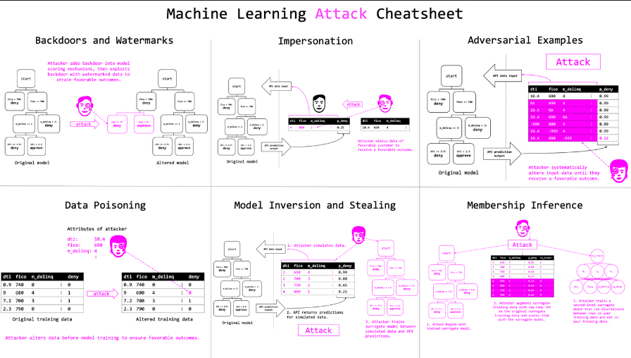

* [On Explainable Machine Learning Misconceptions and A More Human-Centered Machine Learning](https://github.com/jphall663/xai_misconceptions/blob/master/xai_misconceptions.pdf); Patrick Hall; Due to obvious community and commercial demand, explainable machine learning (ML) methods have already been implemented in popular open source software and in commercial software. Yet, as someone who has been involved in the implementation of explainable ML software for the past three years, I find a lot of what I read about the topic confusing and detached from my personal, hands-on experiences. This short text presents arguments, proposals, and references to address some observed explainable ML misconceptions. 

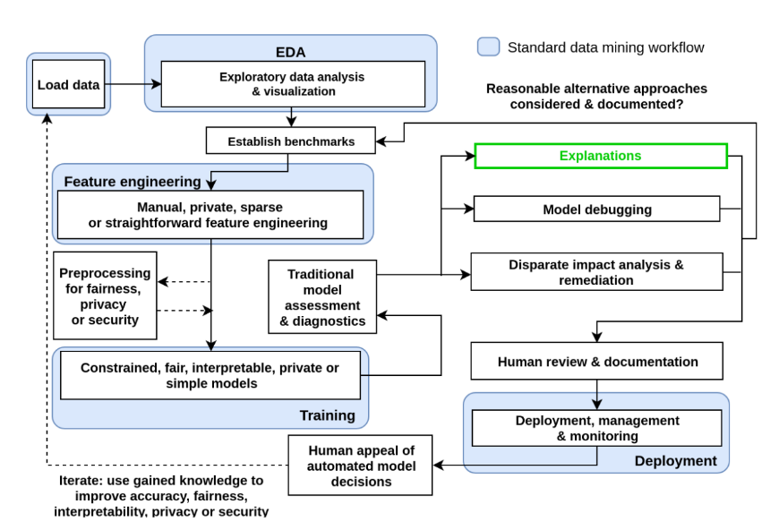

* [Model Cards for Model Reporting](https://arxiv.org/abs/1810.03993); Margaret Mitchell, Simone Wu, Andrew Zaldivar, Parker Barnes, Lucy Vasserman, Ben Hutchinson, Elena Spitzer, Inioluwa Deborah Raji, Timnit Gebru; Trained machine learning models are increasingly used to perform high-impact tasks in areas such as law enforcement, medicine, education, and employment. In order to clarify the intended use cases of machine learning models and minimize their usage in contexts for which they are not well suited, we recommend that released models be accompanied by documentation detailing their performance characteristics. In this paper, we propose a framework that we call model cards, to encourage such transparent model reporting. Model cards are short documents accompanying trained machine learning models that provide benchmarked evaluation in a variety of conditions, such as across different cultural, demographic, or phenotypic groups (e.g., race, geographic location, sex, Fitzpatrick skin type) and intersectional groups (e.g., age and race, or sex and Fitzpatrick skin type) that are relevant to the intended application domains. Model cards also disclose the context in which models are intended to be used, details of the performance evaluation procedures, and other relevant information. While we focus primarily on human-centered machine learning models in the application fields of computer vision and natural language processing, this framework can be used to document any trained machine learning model. To solidify the concept, we provide cards for two supervised models: One trained to detect smiling faces in images, and one trained to detect toxic comments in text. We propose model cards as a step towards the responsible democratization of machine learning and related AI technology, increasing transparency into how well AI technology works. We hope this work encourages those releasing trained machine learning models to accompany model releases with similar detailed evaluation numbers and other relevant documentation. 

* [Unbiased Measurement of Feature Importance in Tree-Based Methods](https://arxiv.org/abs/1903.05179); Zhengze Zhou, Giles Hooker; We propose a modification that corrects for split-improvement variable importance measures in Random Forests and other tree-based methods. These methods have been shown to be biased towards increasing the importance of features with more potential splits. We show that by appropriately incorporating split-improvement as measured on out of sample data, this bias can be corrected yielding better summaries and screening tools. 
* [Please Stop Permuting Features: An Explanation and Alternatives](https://arxiv.org/abs/1905.03151); Giles Hooker, Lucas Mentch;   This paper advocates against permute-and-predict (PaP) methods for interpreting black box functions. Methods such as the variable importance measures proposed for random forests, partial dependence plots, and individual conditional expectation plots remain popular because of their ability to provide model-agnostic measures that depend only on the pre-trained model output. However, numerous studies have found that these tools can produce diagnostics that are highly misleading, particularly when there is strong dependence among features. Rather than simply add to this growing literature by further demonstrating such issues, here we seek to provide an explanation for the observed behavior. In particular, we argue that breaking dependencies between features in hold-out data places undue emphasis on sparse regions of the feature space by forcing the original model to extrapolate to regions where there is little to no data. We explore these effects through various settings where a ground-truth is understood and find support for previous claims in the literature that PaP metrics tend to over-emphasize correlated features both in variable importance and partial dependence plots, even though applying permutation methods to the ground-truth models do not. As an alternative, we recommend more direct approaches that have proven successful in other settings: explicitly removing features, conditional permutations, or model distillation methods. 
    

    
* [Why should you trust my interpretation? Understanding uncertainty in LIME predictions](https://arxiv.org/abs/1904.12991.pdf); Hui Fen (Sarah)Tan, Kuangyan Song, Madeilene Udell, Yiming Sun, Yujia Zhang; Methods for interpreting machine learning black-box models increase the outcomes' transparency and in turn generates insight into the reliability and fairness of the algorithms. However, the interpretations themselves could contain significant uncertainty that undermines the trust in the outcomes and raises concern about the model's reliability. Focusing on the method "Local Interpretable Model-agnostic Explanations" (LIME), we demonstrate the presence of two sources of uncertainty, namely the randomness in its sampling procedure and the variation of interpretation quality across different input data points. Such uncertainty is present even in models with high training and test accuracy. We apply LIME to synthetic data and two public data sets, text classification in 20 Newsgroup and recidivism risk-scoring in COMPAS, to support our argument. 
* [Aequitas: A Bias and Fairness Audit Toolkit](https://arxiv.org/abs/1811.05577); Pedro Saleiro, Benedict Kuester, Loren Hinkson, Jesse London, Abby Stevens, Ari Anisfeld, Kit T. Rodolfa, Rayid Ghani; Recent work has raised concerns on the risk of unintended bias in AI systems being used nowadays that can affect individuals unfairly based on race, gender or religion, among other possible characteristics. While a lot of bias metrics and fairness definitions have been proposed in recent years, there is no consensus on which metric/definition should be used and there are very few available resources to operationalize them. Therefore, despite recent awareness, auditing for bias and fairness when developing and deploying AI systems is not yet a standard practice. We present Aequitas, an open source bias and fairness audit toolkit that is an intuitive and easy to use addition to the machine learning workflow, enabling users to seamlessly test models for several bias and fairness metrics in relation to multiple population sub-groups. Aequitas facilitates informed and equitable decisions around developing and deploying algorithmic decision making systems for both data scientists, machine learning researchers and policymakers. 

* [Variable Importance Clouds: A Way to Explore Variable Importance for the Set of Good Models](https://arxiv.org/abs/1901.03209); Jiayun Dong, Cynthia Rudin; Variable importance is central to scientific studies, including the social sciences and causal inference, healthcare, and in other domains. However, current notions of variable importance are often tied to a specific predictive model. This is problematic: what if there were multiple well-performing predictive models, and a specific variable is important to some of them and not to others? In that case, we may not be able to tell from a single well-performing model whether a variable is always important in predicting the outcome. Rather than depending on variable importance for a single predictive model, we would like to explore variable importance for all approximately-equally-accurate predictive models. This work introduces the concept of a variable importance cloud, which maps every variable to its importance for every good predictive model. We show properties of the variable importance cloud and draw connections other areas of statistics. We introduce variable importance diagrams as a projection of the variable importance cloud into two dimensions for visualization purposes. 

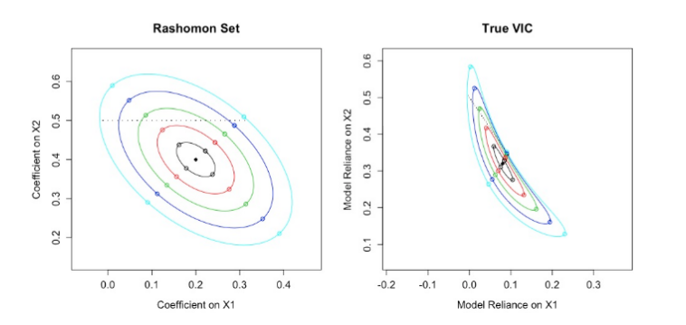

* [A systematic review shows no performance benefit of machine learning over logistic regression for clinical prediction models](https://www.sciencedirect.com/science/article/pii/S0895435618310813); Evangelia Christodoulou, Jie Ma, Gary Collins, Ewout  Steyerberg, Jan Yerbakela, Ben Van Calster; Objectives: The objective of this study was to compare performance of logistic regression (LR) with machine learning (ML) for clinical prediction modeling in the literature. Study Design and Setting: We conducted a Medline literature search (1/2016 to 8/2017) and extracted comparisons between LR and ML models for binary outcomes. Results: We included 71 of 927 studies. The median sample size was 1,250 (range 72–3,994,872), with 19 predictors considered (range 5–563) and eight events per predictor (range 0.3–6,697). The most common ML methods were classification trees, random forests, artificial neural networks, and support vector machines. In 48 (68%) studies, we observed potential bias in the validation procedures. Sixty-four (90%) studies used the area under the receiver operating characteristic curve (AUC) to assess discrimination. Calibration was not addressed in 56 (79%) studies. We identified 282 comparisons between an LR and ML model (AUC range, 0.52–0.99). For 145 comparisons at low risk of bias, the difference in logit(AUC) between LR and ML was 0.00 (95% confidence interval, −0.18 to 0.18). For 137 comparisons at high risk of bias, logit(AUC) was 0.34 (0.20–0.47) higher for ML. Conclusion: We found no evidence of superior performance of ML over LR. Improvements in methodology and reporting are needed for studies that compare modeling algorithms.

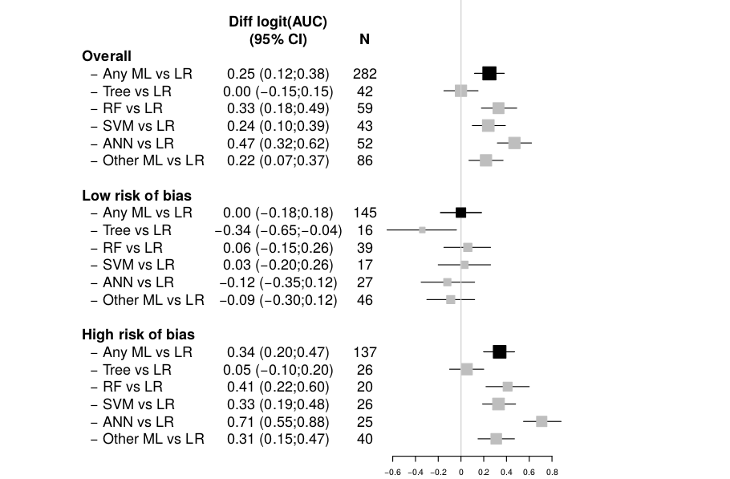

* [iBreakDown: Uncertainty of Model Explanations for Non-additive Predictive Models](https://arxiv.org/abs/1903.11420); Alicja Gosiewska, Przemyslaw Biecek; Explainable Artificial Intelligence (XAI) brings a lot of attention recently. Explainability is being presented as a remedy for lack of trust in model predictions. Model agnostic tools such as LIME, SHAP, or Break Down promise instance level interpretability for any complex machine learning model. But how certain are these explanations? Can we rely on additive explanations for non-additive models? In this paper, we examine the behavior of model explainers under the presence of interactions. We define two sources of uncertainty, model level uncertainty, and explanation level uncertainty. We show that adding interactions reduces explanation level uncertainty. We introduce a new method iBreakDown that generates non-additive explanations with local interaction. 

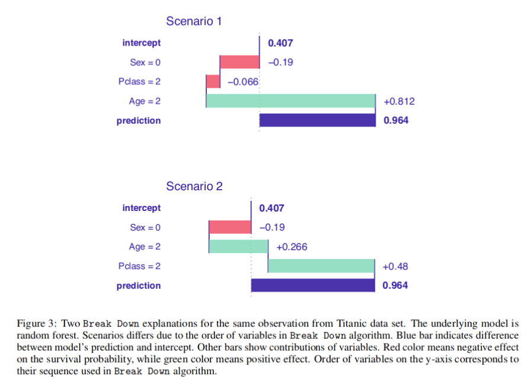

* [Sampling, Intervention, Prediction, Aggregation: A Generalized Framework for Model Agnostic Interpretations](https://arxiv.org/abs/1904.03959); Christian A. Scholbeck, Christoph Molnar, Christian Heumann, Bernd Bischl, Giuseppe Casalicchio; Non-linear machine learning models often trade off a great predictive performance for a lack of interpretability. However, model agnostic interpretation techniques now allow us to estimate the effect and importance of features for any predictive model. Different notations and terminology have complicated their understanding and how they are related. A unified view on these methods has been missing. We present the generalized SIPA (Sampling, Intervention, Prediction, Aggregation) framework of work stages for model agnostic interpretation techniques and demonstrate how several prominent methods for feature effects can be embedded into the proposed framework. We also formally introduce pre-existing marginal effects to describe feature effects for black box models. Furthermore, we extend the framework to feature importance computations by pointing out how variance-based and performance-based importance measures are based on the same work stages. The generalized framework may serve as a guideline to conduct model agnostic interpretations in machine learning. 

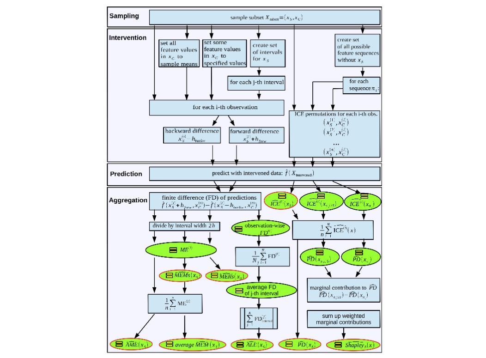

* [Quantifying Interpretability of Arbitrary Machine Learning Models Through Functional Decomposition](https://arxiv.org/abs/1904.03867); Christoph Molnar, Giuseppe Casalicchio, Bernd Bischl; To obtain interpretable machine learning models, either interpretable models are constructed from the outset - e.g. shallow decision trees, rule lists, or sparse generalized linear models - or post-hoc interpretation methods - e.g. partial dependence or ALE plots - are employed. Both approaches have disadvantages. While the former can restrict the hypothesis space too conservatively, leading to potentially suboptimal solutions, the latter can produce too verbose or misleading results if the resulting model is too complex, especially w.r.t. feature interactions. We propose to make the compromise between predictive power and interpretability explicit by quantifying the complexity / interpretability of machine learning models. Based on functional decomposition, we propose measures of number of features used, interaction strength and main effect complexity. We show that post-hoc interpretation of models that minimize the three measures becomes more reliable and compact. Furthermore, we demonstrate the application of such measures in a multi-objective optimization approach which considers predictive power and interpretability at the same time. 

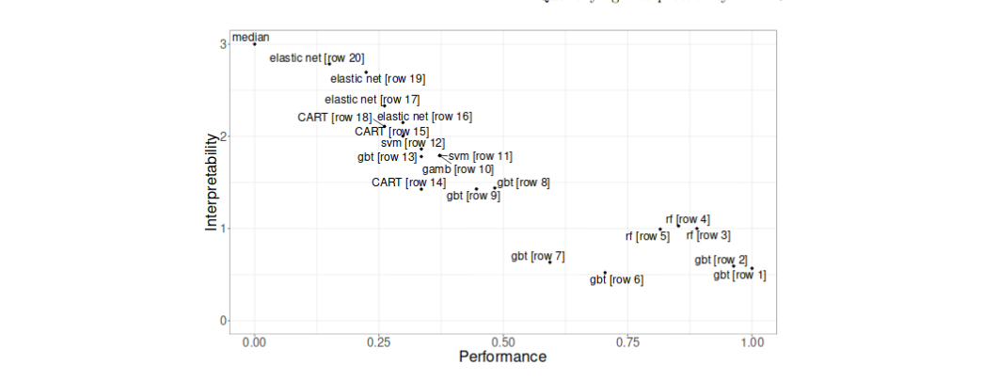

* [One pixel attack for fooling deep neural networks](https://arxiv.org/abs/1710.08864); Jiawei Su, Danilo Vasconcellos Vargas, Sakurai Kouichi; Recent research has revealed that the output of Deep Neural Networks (DNN) can be easily altered by adding relatively small perturbations to the input vector. In this paper, we analyze an attack in an extremely limited scenario where only one pixel can be modified. For that we propose a novel method for generating one-pixel adversarial perturbations based on differential evolution(DE). It requires less adversarial information(a black-box attack) and can fool more types of networks due to the inherent features of DE. The results show that 68.36% of the natural images in CIFAR-10 test dataset and 41.22% of the ImageNet (ILSVRC 2012) validation images can be perturbed to at least one target class by modifying just one pixel with 73.22% and 5.52% confidence on average. Thus, the proposed attack explores a different take on adversarial machine learning in an extreme limited scenario, showing that current DNNs are also vulnerable to such low dimension attacks. Besides, we also illustrate an important application of DE (or broadly speaking, evolutionary computation) in the domain of adversarial machine learning: creating tools that can effectively generate low-cost adversarial attacks against neural networks for evaluating robustness. 

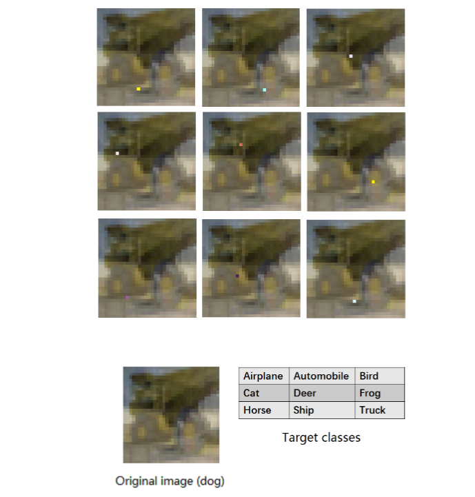

* [VINE: Visualizing Statistical Interactions in Black Box Models](https://arxiv.org/abs/1904.00561); Matthew Britton; As machine learning becomes more pervasive, there is an urgent need for interpretable explanations of predictive models. Prior work has developed effective methods for visualizing global model behavior, as well as generating local (instance-specific) explanations. However, relatively little work has addressed regional explanations - how groups of similar instances behave in a complex model, and the related issue of visualizing statistical feature interactions. The lack of utilities available for these analytical needs hinders the development of models that are mission-critical, transparent, and align with social goals. We present VINE (Visual INteraction Effects), a novel algorithm to extract and visualize statistical interaction effects in black box models. We also present a novel evaluation metric for visualizations in the interpretable ML space. 

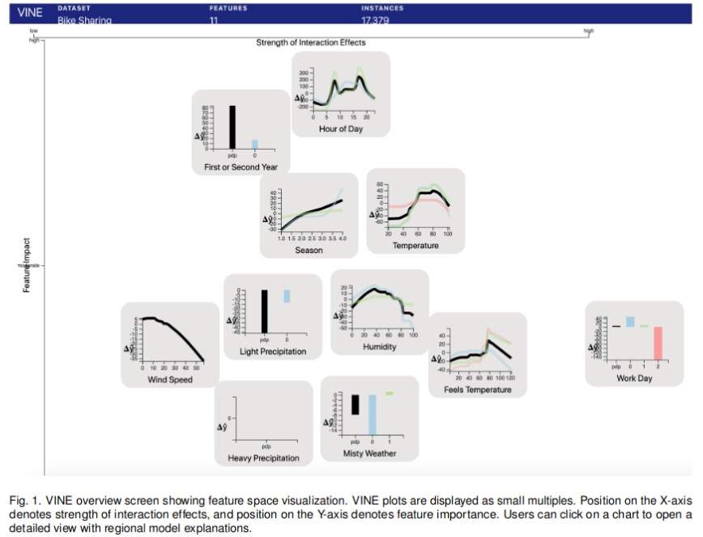

* [Clinical applications of machine learning algorithms: beyond the black box](https://www.bmj.com/content/364/bmj.l886); David Watson et al;     Machine learning algorithms may radically improve our ability to diagnose and treat disease; For moral, legal, and scientific reasons, it is essential that doctors and patients be able to understand and explain the predictions of these models; Scalable, customisable, and ethical solutions can be achieved by working together with relevant stakeholders, including patients, data scientists, and policy makers
* [ICIE 1.0: A Novel Tool for InteractiveContextual Interaction Explanations](http://wwwis.win.tue.nl/~wouter/Publ/W6-ICIE.pdf); Simon B. van der Zon et al; With the rise of new laws around privacy and awareness,explanation of automated decision making becomes increasingly impor-tant.  Nowadays, machine  learning  models  are  used  to  aid  experts  indomains such as banking and insurance to find suspicious transactions,approve loans and credit card applications. Companies using such sys-tems have to be able to provide the rationale behind their decisions;blindly relying on the trained model is not sufficient. There are currentlya number of methods that provide insights in models and their decisions,but often they are either good at showing global or local behavior. Globalbehavior is often too complex to visualize or comprehend, so approxima-tions are shown, and visualizing local behavior is often misleading as itis difficult to define what local exactly means (i.e. our methods don’t“know” how easily a feature-value can be changed; which ones are flexi-ble, and which ones are static). We introduce theICIEframework (Inter-active Contextual Interaction Explanations) which enables users to viewexplanations of individual instances under differentcontexts.Wewillseethat various contexts for the same case lead to different explanations,revealing different feature interaction

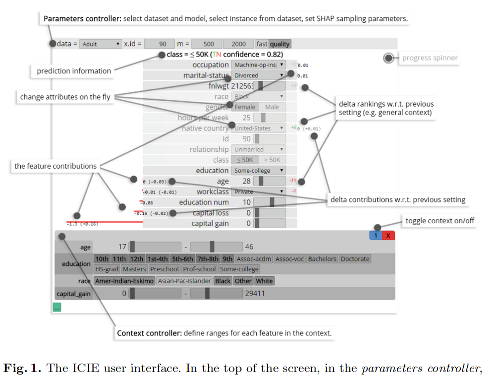

* [Explanation in Human-AI Systems: A Literature Meta-Review, Synopsis of Key Ideas and Publications, and Bibliography for Explainable AI](https://arxiv.org/abs/1902.01876v1); Shane T. Mueller, Robert R. Hoffman, William Clancey, Abigail Emrey, Gary Klein; This is an integrative review that address the question, "What makes for a good explanation?" with reference to AI systems. Pertinent literatures are vast. Thus, this review is necessarily selective. That said, most of the key concepts and issues are expressed in this Report. The Report encapsulates the history of computer science efforts to create systems that explain and instruct (intelligent tutoring systems and expert systems). The Report expresses the explainability issues and challenges in modern AI, and presents capsule views of the leading psychological theories of explanation. Certain articles stand out by virtue of their particular relevance to XAI, and their methods, results, and key points are highlighted. 
* [Explaining Explanations: An Overview of Interpretability of Machine Learning](https://arxiv.org/abs/1806.00069); Leilani H. Gilpin, David Bau, Ben Z. Yuan, Ayesha Bajwa, Michael Specter, Lalana Kagal; There has recently been a surge of work in explanatory artificial intelligence (XAI). This research area tackles the important problem that complex machines and algorithms often cannot provide insights into their behavior and thought processes. XAI allows users and parts of the internal system to be more transparent, providing explanations of their decisions in some level of detail. These explanations are important to ensure algorithmic fairness, identify potential bias/problems in the training data, and to ensure that the algorithms perform as expected. However, explanations produced by these systems is neither standardized nor systematically assessed. In an effort to create best practices and identify open challenges, we provide our definition of explainability and show how it can be used to classify existing literature. We discuss why current approaches to explanatory methods especially for deep neural networks are insufficient. 
* [SAFE ML: Surrogate Assisted Feature Extraction for Model Learning](https://arxiv.org/abs/1902.11035); Alicja Gosiewska, Aleksandra Gacek, Piotr Lubon, Przemyslaw Biecek; Complex black-box predictive models may have high accuracy, but opacity causes problems like lack of trust, lack of stability, sensitivity to concept drift. On the other hand, interpretable models require more work related to feature engineering, which is very time consuming. Can we train interpretable and accurate models, without timeless feature engineering? In this article, we show a method that uses elastic black-boxes as surrogate models to create a simpler, less opaque, yet still accurate and interpretable glass-box models. New models are created on newly engineered features extracted/learned with the help of a surrogate model. We show applications of this method for model level explanations and possible extensions for instance level explanations. We also present an example implementation in Python and benchmark this method on a number of tabular data sets.
* [Attention is not Explanation](https://arxiv.org/abs/1902.10186); Sarthak Jain, Byron C. Wallace; Attention mechanisms have seen wide adoption in neural NLP models. In addition to improving predictive performance, these are often touted as affording transparency: models equipped with attention provide a distribution over attended-to input units, and this is often presented (at least implicitly) as communicating the relative importance of inputs. However, it is unclear what relationship exists between attention weights and model outputs. In this work, we perform extensive experiments across a variety of NLP tasks that aim to assess the degree to which attention weights provide meaningful `explanations` for predictions. We find that they largely do not. For example, learned attention weights are frequently uncorrelated with gradient-based measures of feature importance, and one can identify very different attention distributions that nonetheless yield equivalent predictions. Our findings show that standard attention modules do not provide meaningful explanations and should not be treated as though they do. 
* [Efficient Search for Diverse Coherent Explanations](https://arxiv.org/abs/1901.04909); Chris Russell; This paper proposes new search algorithms for counterfactual explanations based upon mixed integer programming. We are concerned with complex data in which variables may take any value from a contiguous range or an additional set of discrete states. We propose a novel set of constraints that we refer to as a "mixed polytope" and show how this can be used with an integer programming solver to efficiently find coherent counterfactual explanations i.e. solutions that are guaranteed to map back onto the underlying data structure, while avoiding the need for brute-force enumeration. We also look at the problem of diverse explanations and show how these can be generated within our framework.
* [Seven Myths in Machine Learning Research](https://arxiv.org/abs/1902.06789v1); Oscar Chang, Hod Lipson; As deep learning becomes more and more ubiquitous in high stakes applications like medical imaging, it is important to be careful of how we interpret decisions made by neural networks. For example, while it would be nice to have a CNN identify a spot on an MRI image as a malignant cancer-causing tumor, these results should not be trusted if they are based on fragile interpretation methods
* [Towards Aggregating Weighted Feature Attributions](https://arxiv.org/abs/1901.10040); Umang Bhatt, Pradeep Ravikumar, Jose M. F. Moura; Current approaches for explaining machine learning models fall into two distinct classes: antecedent event influence and value attribution. The former leverages training instances to describe how much influence a training point exerts on a test point, while the latter attempts to attribute value to the features most pertinent to a given prediction. In this work, we discuss an algorithm, AVA: Aggregate Valuation of Antecedents, that fuses these two explanation classes to form a new approach to feature attribution that not only retrieves local explanations but also captures global patterns learned by a model. 
* [An Evaluation of the Human-Interpretability of Explanation](https://arxiv.org/abs/1902.00006v1); Isaac Lage, Emily Chen, Jeffrey He, Menaka Narayanan, Been Kim, Sam Gershman, Finale Doshi-Velez; What kinds of explanation are truly human-interpretable remains poorly understood. This work advances our understanding of what makes explanations interpretable under three specific tasks that users may perform with machine learning systems: simulation of the response, verification of a suggested response, and determining whether the correctness of a suggested response changes under a change to the inputs. Through carefully controlled human-subject experiments, we identify regularizers that can be used to optimize for the interpretability of machine learning systems. Our results show that the type of complexity matters: cognitive chunks (newly defined concepts) affect performance more than variable repetitions, and these trends are consistent across tasks and domains. This suggests that there may exist some common design principles for explanation systems.
* [Interpretable machine learning: definitions, methods, and applications](https://export.arxiv.org/pdf/1901.04592); W. James Murdocha, Chandan Singh, Karl Kumbiera, Reza Abbasi-As, and Bin Yu; Machine-learning models have demonstrated great success in learning complex patterns that enable them to make predictions about unobserved data. In addition to using models for prediction, the ability to interpret what a model has learned is receiving an increasing amount of attention. However, this increased focus has led to considerable confusion about the notion of interpretability. In particular, it is unclear how the wide array of proposed interpretation methods are related, and what common concepts can be used to evaluate them.
* [Learning Optimal and Fair Decision Trees for Non-Discriminative Decision-Making](http://www-bcf.usc.edu/~vayanou/papers/2019/Fair_DT_AAAI_2019_CameraReady.pdf); Sina Aghaei, Mohammad Javad Azizi, Phebe Vayanos; In recent years, automated data-driven decision-making systems have enjoyed a tremendous success in a variety of fields (e.g., to make product recommendations, or to guide the production of entertainment). More recently, these algorithms are increasingly being used to assist socially sensitive decisionmaking (e.g., to decide who to admit into a degree program or to prioritize individuals for public housing). Yet, these automated tools may result in discriminative decision-making in the sense that they may treat individuals unfairly or unequally based on membership to a category or a minority, resulting in disparate treatment or disparate impact and violating both moral and ethical standards. This may happen when the training dataset is itself biased (e.g., if individuals belonging to a particular group have historically been discriminated upon). However, it may also happen when the training dataset is unbiased, if the errors made by the system affect individuals belonging to a category or minority differently (e.g., if misclassification rates for Blacks are higher than for Whites). In this paper, we unify the definitions of unfairness across classification and regression. We propose a versatile mixed-integer optimization framework for learning optimal and fair decision trees and variants thereof to prevent disparate treatment and/or disparate impact as appropriate. This translates to a flexible schema for designing fair and interpretable policies suitable for socially sensitive decision-making. We conduct extensive computational studies that show that our framework improves the state-of-the-art in the field (which typically relies on heuristics) to yield non-discriminative decisions at lower cost to overall accuracy.

* [Understanding Individual Decisions of CNNs via Contrastive Backpropagation](https://arxiv.org/pdf/1812.02100.pdf); Jindong Gu, Yinchong Yang, Volker Tresp; A number of backpropagation-based approaches such as DeConvNets, vanilla Gradient Visualization and Guided Backpropagation have been proposed to better understand individual decisions of deep convolutional neural networks. The saliency maps produced by them are proven to be non-discriminative. Recently, the Layer-wise Relevance Propagation (LRP) approach was proposed to explain the classification decisions of rectifier neural networks. In this work, we evaluate the discriminativeness of the generated explanations and analyze the theoretical foundation of LRP, i.e. Deep Taylor Decomposition. The experiments and analysis conclude that the explanations generated by LRP are not class-discriminative. Based on LRP, we propose Contrastive Layer-wise Relevance Propagation (CLRP), which is capable of producing instance-specific, class-discriminative, pixel-wise explanations. In the experiments, we use the CLRP to explain the decisions and understand the difference between neurons in individual classification decisions. We also evaluate the explanations quantitatively with a Pointing Game and an ablation study. Both qualitative and quantitative evaluations show that the CLRP generates better explanations than the LRP. The code is available.

### 2018

* [Conversational Explanations of Machine Learning PredictionsThrough Class-contrastive Counterfactual Statements](https://www.ijcai.org/proceedings/2018/0836.pdf); Kacper Sokol, Peter Flach;  Machine  learning  models  have  become  pervasivein our everyday life; they decide on important mat-ters influencing our education, employment and ju-dicial  system.   Many  of  these  predictive  systemsare commercial products protected by trade secrets,hence their decision-making is opaque.  Therefore,in our research we address interpretability and ex-plainability of predictions made by machine learn-ing models. Our work draws heavily on human ex-planation  research  in  social  sciences:   contrastiveand exemplar explanations provided through a di-alogue.  This user-centric design, focusing on a layaudience rather than domain experts, applied to ma-chine learning allows explainees to drive the expla-nation to suit their needs instead of being served aprecooked template.

* [Interpretability Beyond Feature Attribution: Quantitative Testing with Concept Activation Vectors (TCAV)](https://arxiv.org/abs/1711.11279); Been Kim, Martin Wattenberg, Justin Gilmer, Carrie Cai, James Wexler, Fernanda Viegas, Rory Sayres; The interpretation of deep learning models is a challenge due to their size, complexity, and often opaque internal state. In addition, many systems, such as image classifiers, operate on low-level features rather than high-level concepts. To address these challenges, we introduce Concept Activation Vectors (CAVs), which provide an interpretation of a neural net's internal state in terms of human-friendly concepts. The key idea is to view the high-dimensional internal state of a neural net as an aid, not an obstacle. We show how to use CAVs as part of a technique, Testing with CAVs (TCAV), that uses directional derivatives to quantify the degree to which a user-defined concept is important to a classification result--for example, how sensitive a prediction of "zebra" is to the presence of stripes. Using the domain of image classification as a testing ground, we describe how CAVs may be used to explore hypotheses and generate insights for a standard image classification network as well as a medical application. [TowardsDataScience](https://towardsdatascience.com/tcav-interpretability-beyond-feature-attribution-79b4d3610b4d).

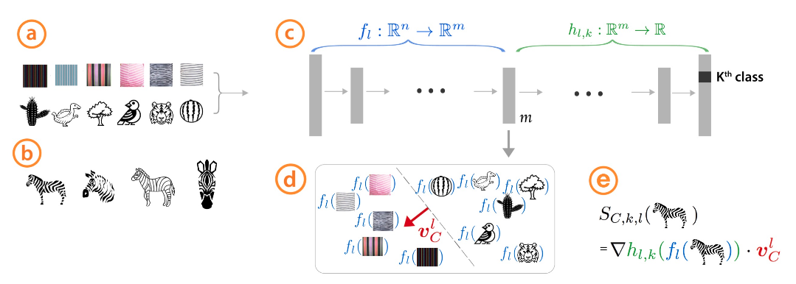

* [Machine Decisions and Human Consequences](https://arxiv.org/abs/1811.06747); Draft of a chapter that has been accepted for publication by Oxford University Press in the forthcoming book “Algorithmic Regulation”; Teresa Scantamburlo, Andrew Charlesworth, Nello Cristianini; The discussion here focuses primarily on the case of enforcement decisions in the criminal justice system, but draws on similar situations emerging from other algorithms utilised in controlling access to opportunities, to explain how machine learning works and, as a result, how decisions are made by modern intelligent algorithms or 'classifiers'. It examines the key aspects of the performance of classifiers, including how classifiers learn, the fact that they operate on the basis of correlation rather than causation, and that the term 'bias' in machine learning has a different meaning to common usage. An example of a real world 'classifier', the Harm Assessment Risk Tool (HART), is examined, through identification of its technical features: the classification method, the training data and the test data, the features and the labels, validation and performance measures. Four normative benchmarks are then considered by reference to HART: (a) prediction accuracy (b) fairness and equality before the law (c) transparency and accountability (d) informational privacy and freedom of expression, in order to demonstrate how its technical features have important normative dimensions that bear directly on the extent to which the system can be regarded as a viable and legitimate support for, or even alternative to, existing human decision-makers. 

* [Controversy Rules - Discovering Regions Where Classifiers (Dis-)Agree Exceptionally](https://arxiv.org/abs/1808.07243); Oren Zeev-Ben-Mordehai, Wouter Duivesteijn, Mykola Pechenizkiy; Finding regions for which there is higher controversy among different classifiers is insightful with regards to the domain and our models. Such evaluation can falsify assumptions, assert some, or also, bring to the attention unknown phenomena. The present work describes an algorithm, which is based on the Exceptional Model Mining framework, and enables that kind of investigations. We explore several public datasets and show the usefulness of this approach in classification tasks. We show in this paper a few interesting observations about those well explored datasets, some of which are general knowledge, and other that as far as we know, were not reported before.  

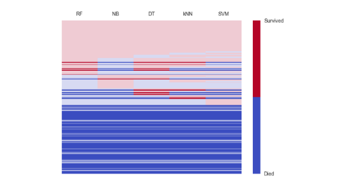

* [Stealing Hyperparameters in Machine Learning](https://arxiv.org/abs/1802.05351); Binghui Wang, Neil Zhenqiang Gong; Hyperparameters are critical in machine learning, as different hyperparameters often result in models with significantly different performance. Hyperparameters may be deemed confidential because of their commercial value and the confidentiality of the proprietary algorithms that the learner uses to learn them. In this work, we propose attacks on stealing the hyperparameters that are learned by a learner. We call our attacks hyperparameter stealing attacks. Our attacks are applicable to a variety of popular machine learning algorithms such as ridge regression, logistic regression, support vector machine, and neural network. We evaluate the effectiveness of our attacks both theoretically and empirically. For instance, we evaluate our attacks on Amazon Machine Learning. Our results demonstrate that our attacks can accurately steal hyperparameters. We also study countermeasures. Our results highlight the need for new defenses against our hyperparameter stealing attacks for certain machine learning algorithms. 
* [Distill-and-Compare: Auditing Black-Box Models Using Transparent Model Distillation](https://arxiv.org/abs/1710.06169); Black-box risk scoring models permeate our lives, yet are typically proprietary or opaque. We propose Distill-and-Compare, a model distillation and comparison approach to audit such models. To gain insight into black-box models, we treat them as teachers, training transparent student models to mimic the risk scores assigned by black-box models. We compare the student model trained with distillation to a second un-distilled transparent model trained on ground-truth outcomes, and use differences between the two models to gain insight into the black-box model. Our approach can be applied in a realistic setting, without probing the black-box model API. We demonstrate the approach on four public data sets: COMPAS, Stop-and-Frisk, Chicago Police, and Lending Club. We also propose a statistical test to determine if a data set is missing key features used to train the black-box model. Our test finds that the ProPublica data is likely missing key feature(s) used in COMPAS. 

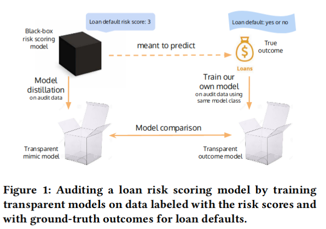

* [DIVE: A Mixed-Initiative System Supporting Integrated DataExploration Workflows](https://static1.squarespace.com/static/5759bc7886db431d658b7d33/t/5b969d5c89858325956a939f/1536597342848/DIVE_HILDA_2018.pdf); Kevin Hu et al; Generating knowledge from data is an increasingly important ac-tivity. This process of data exploration consists of multiple tasks:data ingestion, visualization, statistical analysis, and storytelling.Though these tasks are complementary, analysts often execute themin separate tools. Moreover, these tools have steep learning curvesdue to their reliance on manual query specification. Here, we de-scribe the design and implementation of DIVE, a web-based systemthat integrates state-of-the-art data exploration features into a sin-gle tool. DIVE contributes a mixed-initiative interaction schemethat combines recommendation with point-and-click manual spec-ification, and a consistent visual language that unifies differentstages of the data exploration workflow. In a controlled user studywith 67 professional data scientists, we find that DIVE users weresignificantly more successful and faster than Excel users at com-pleting predefined data visualization and analysis tasks

* [Learning Explanatory Rules from Noisy Data](https://arxiv.org/abs/1711.04574); Richard Evans, Edward Grefenstette; Artificial Neural Networks are powerful function approximators capable of modelling solutions to a wide variety of problems, both supervised and unsupervised. As their size and expressivity increases, so too does the variance of the model, yielding a nearly ubiquitous overfitting problem. Although mitigated by a variety of model regularisation methods, the common cure is to seek large amounts of training data---which is not necessarily easily obtained---that sufficiently approximates the data distribution of the domain we wish to test on. In contrast, logic programming methods such as Inductive Logic Programming offer an extremely data-efficient process by which models can be trained to reason on symbolic domains. However, these methods are unable to deal with the variety of domains neural networks can be applied to: they are not robust to noise in or mislabelling of inputs, and perhaps more importantly, cannot be applied to non-symbolic domains where the data is ambiguous, such as operating on raw pixels. In this paper, we propose a Differentiable Inductive Logic framework, which can not only solve tasks which traditional ILP systems are suited for, but shows a robustness to noise and error in the training data which ILP cannot cope with. 
* [Towards Interpretable R-CNN by Unfolding Latent Structures](https://arxiv.org/pdf/1711.05226.pdf); Tianfu Wu, Xilai Li, Xi Song, Wei Sun, Liang Dong and Bo Li; This paper presents a method of learning qualitatively interpretable models in object detection using popular two-stage region-based ConvNet detection systems (i.e., R-CNN). R-CNN consists of a region proposal network and a RoI (Region-of-Interest) prediction network. By interpretable models, we focus on weaklysupervised extractive rationale generation, that is learning to unfold latent discriminative part configurations of object instances automatically and simultaneously in detection without using any supervision for part configurations. We utilize a top-down hierarchical and compositional grammar model embedded in a directed acyclic AND-OR Graph (AOG) to explore and unfold the space of latent part configurations of RoIs. We propose an AOGParsing operator to substitute the RoIPooling operator widely used in RCNN, so the proposed method is applicable to many stateof-the-art ConvNet based detection systems. 
* [Fair lending needs explainable models for responsible recommendation](https://arxiv.org/abs/1809.04684); Jiahao Chen; The financial services industry has unique explainability and fairness challenges arising from compliance and ethical considerations in credit decisioning. These challenges complicate the use of model machine learning and artificial intelligence methods in business decision processes.
* [ICIE 1.0: A Novel Tool for Interactive Contextual Interaction Explanations](https://link.springer.com/chapter/10.1007/978-3-030-13463-1_6); Simon B. van der Zon; Wouter Duivesteijn; Werner van Ipenburg; Jan Veldsink; Mykola Pechenizkiy; With the rise of new laws around privacy and awareness, explanation of automated decision making becomes increasingly important. Nowadays, machine learning models are used to aid experts in domains such as banking and insurance to find suspicious transactions, approve loans and credit card applications. Companies using such systems have to be able to provide the rationale behind their decisions; blindly relying on the trained model is not sufficient. There are currently a number of methods that provide insights in models and their decisions, but often they are either good at showing global or local behavior. Global behavior is often too complex to visualize or comprehend, so approximations are shown, and visualizing local behavior is often misleading as it is difficult to define what local exactly means (i.e. our methods don’t “know” how easily a feature-value can be changed; which ones are flexible, and which ones are static). We introduce the ICIE framework (Interactive Contextual Interaction Explanations) which enables users to view explanations of individual instances under different contexts. We will see that various contexts for the same case lead to different explanations, revealing different feature interactions.
* [Delayed Impact of Fair Machine Learning](https://arxiv.org/pdf/1803.04383.pdf); Lydia T. Liu, Sarah Dean, Esther Rolf, Max Simchowitz, Moritz Hardt; Fairness in machine learning has predominantly been studied in static classification settings without concern for how decisions change the underlying population over time. Conventional wisdom suggests that fairness criteria promote the long-term well-being of those groups they aim to protect.  We study how static fairness criteria interact with temporal indicators of well-being, such as long-term improvement, stagnation, and decline in a variable of interest. We demonstrate that even in a one-step feedback model, common fairness criteria in general do not promote improvement over time, and may in fact cause harm in cases where an unconstrained objective would not.  We completely characterize the delayed impact of three standard criteria, contrasting the regimes in which these exhibit qualitatively different behavior. In addition, we find that a natural form of measurement error broadens the regime in which fairness criteria perform favorably.  Our results highlight the importance of measurement and temporal modeling in the evaluation of fairness criteria, suggesting a range of new challenges and trade-offs.
* [The Challenge of Crafting Intelligible Intelligence](https://arxiv.org/abs/1803.04263); Daniel S. Weld, Gagan Bansal; Since Artificial Intelligence (AI) software uses techniques like deep lookahead search and stochastic optimization of huge neural networks to fit mammoth datasets, it often results in complex behavior that is difficult for people to understand. Yet organizations are deploying AI algorithms in many mission-critical settings. To trust their behavior, we must make AI intelligible, either by using inherently interpretable models or by developing new methods for explaining and controlling otherwise overwhelmingly complex decisions using local approximation, vocabulary alignment, and interactive explanation. This paper argues that intelligibility is essential, surveys recent work on building such systems, and highlights key directions for research.
* [An Interpretable Model with Globally Consistent Explanations for Credit Risk](https://arxiv.org/abs/1811.12615); Chaofan Chen, Kangcheng Lin, Cynthia Rudin, Yaron Shaposhnik, Sijia Wang, Tong Wang; We propose a possible solution to a public challenge posed by the Fair Isaac Corporation (FICO), which is to provide an explainable model for credit risk assessment. Rather than present a black box model and explain it afterwards, we provide a globally interpretable model that is as accurate as other neural networks. Our "two-layer additive risk model" is decomposable into subscales, where each node in the second layer represents a meaningful subscale, and all of the nonlinearities are transparent. We provide three types of explanations that are simpler than, but consistent with, the global model. One of these explanation methods involves solving a minimum set cover problem to find high-support globally-consistent explanations. We present a new online visualization tool to allow users to explore the global model and its explanations.
* [HELOC Applicant Risk Performance Evaluation by Topological Hierarchical Decomposition](https://arxiv.org/abs/1811.10658); Kyle Brown, Derek Doran, Ryan Kramer, Brad Reynolds; Strong regulations in the financial industry mean that any decisions based on machine learning need to be explained. This precludes the use of powerful supervised techniques such as neural networks. In this study we propose a new unsupervised and semi-supervised technique known as the topological hierarchical decomposition (THD). This process breaks a dataset down into ever smaller groups, where groups are associated with a simplicial complex that approximate the underlying topology of a dataset. We apply THD to the FICO machine learning challenge dataset, consisting of anonymized home equity loan applications using the MAPPER algorithm to build simplicial complexes. We identify different groups of individuals unable to pay back loans, and illustrate how the distribution of feature values in a simplicial complex can be used to explain the decision to grant or deny a loan by extracting illustrative explanations from two THDs on the dataset.
* [From Black-Box to White-Box: Interpretable Learning with Kernel Machines](https://link.springer.com/chapter/10.1007%2F978-3-319-96136-1_18); Hao Zhang, Shinji Nakadai, Kenji Fukumizu; We present a novel approach to interpretable learning with kernel machines. In many real-world learning tasks, kernel machines have been successfully applied. However, a common perception is that they are difficult to interpret by humans due to the inherent black-box nature. This restricts the application of kernel machines in domains where model interpretability is highly required. In this paper, we propose to construct interpretable kernel machines. Specifically, we design a new kernel function based on random Fourier features (RFF) for scalability, and develop a two-phase learning procedure: in the first phase, we explicitly map pairwise features to a high-dimensional space produced by the designed kernel, and learn a dense linear model; in the second phase, we extract an interpretable data representation from the first phase, and learn a sparse linear model. Finally, we evaluate our approach on benchmark datasets, and demonstrate its usefulness in terms of interpretability by visualization.
* [From Soft Classifiers to Hard Decisions: How fair can we be?](https://arxiv.org/abs/1810.02003); Ran Canetti, Aloni Cohen, Nishanth Dikkala, Govind Ramnarayan, Sarah Scheffler, Adam Smith;  We study the feasibility of achieving various fairness properties by post-processing calibrated scores, and then show that deferring post-processors allow for more fairness conditions to hold on the final decision. Specifically, we show: 1. There does not exist a general way to post-process a calibrated classifier to equalize protected groups' positive or negative predictive value (PPV or NPV). For certain "nice" calibrated classifiers, either PPV or NPV can be equalized when the post-processor uses different thresholds across protected groups... 2. When the post-processing is allowed to defer on some decisions (that is, to avoid making a decision by handing off some examples to a separate process), then for the non-deferred decisions, the resulting classifier can be made to equalize PPV, NPV, false positive rate (FPR) and false negative rate (FNR) across the protected groups. This suggests a way to partially evade the impossibility results of Chouldechova and Kleinberg et al., which preclude equalizing all of these measures simultaneously. We also present different deferring strategies and show how they affect the fairness properties of the overall system.  We evaluate our post-processing techniques using the COMPAS data set from 2016.
* [A Survey of Methods for Explaining Black Box Models](https://dl.acm.org/citation.cfm?id=3236009); Riccardo Guidotti, Anna Monreale, Salvatore Ruggieri, Franco Turini, Fosca Giannotti, Dino Pedreschi;  In recent years, many accurate decision support systems have been constructed as black boxes, that is as systems that hide their internal logic to the user. This lack of explanation constitutes both a practical and an ethical issue. The literature reports many approaches aimed at overcoming this crucial weakness, sometimes at the cost of sacrificing accuracy for interpretability. The applications in which black box decision systems can be used are various, and each approach is typically developed to provide a solution for a specific problem and, as a consequence, it explicitly or implicitly delineates its own definition of interpretability and explanation. The aim of this article is to provide a classification of the main problems addressed in the literature with respect to the notion of explanation and the type of black box system. Given a problem definition, a black box type, and a desired explanation, this survey should help the researcher to find the proposals more useful for his own work. The proposed classification of approaches to open black box models should also be useful for putting the many research open questions in perspective.
* [Deep k-Nearest Neighbors: Towards Confident, Interpretable and Robust Deep Learning](https://arxiv.org/abs/1803.04765); Nicolas Papernot, Patrick McDaniel;  In this work, we exploit the structure of deep learning to enable new learning-based inference and decision strategies that achieve desirable properties such as robustness and interpretability. We take a first step in this direction and introduce the Deep k-Nearest Neighbors (DkNN). This hybrid classifier combines the k-nearest neighbors algorithm with representations of the data learned by each layer of the DNN: a test input is compared to its neighboring training points according to the distance that separates them in the representations. We show the labels of these neighboring points afford confidence estimates for inputs outside the model's training manifold, including on malicious inputs like adversarial examples--and therein provides protections against inputs that are outside the models understanding. This is because the nearest neighbors can be used to estimate the nonconformity of, i.e., the lack of support for, a prediction in the training data. The neighbors also constitute human-interpretable explanations of predictions.
* [RISE: Randomized Input Sampling for Explanation of Black-box Models](https://arxiv.org/abs/1806.07421); Vitali Petsiuk, Abir Das, Kate Saenko; Deep neural networks are being used increasingly to automate data analysis and decision making, yet their decision-making process is largely unclear and is difficult to explain to the end users. In this paper, we address the problem of Explainable AI for deep neural networks that take images as input and output a class probability. We propose an approach called RISE that generates an importance map indicating how salient each pixel is for the model's prediction. In contrast to white-box approaches that estimate pixel importance using gradients or other internal network state, RISE works on black-box models. It estimates importance empirically by probing the model with randomly masked versions of the input image and obtaining the corresponding outputs. We compare our approach to state-of-the-art importance extraction methods using both an automatic deletion/insertion metric and a pointing metric based on human-annotated object segments. Extensive experiments on several benchmark datasets show that our approach matches or exceeds the performance of other methods, including white-box approaches. 
* [Visualizing the Feature Importance for Black Box Models](https://arxiv.org/pdf/1804.06620.pdf); Giuseppe Casalicchio, Christoph Molnar, and Bernd Bisch; Based on a recent method for model-agnostic global feature importance, we introduce a local feature importance measure for individual observations and propose two visual tools: partial importance (PI) and individual conditional importance (ICI) plots which visualize how changes in a feature affect the model performance on average, as well as for individual observations. Our proposed methods are related to partial dependence (PD) and individual conditional expectation (ICE) plots, but visualize the expected (conditional) feature importance instead of the expected (conditional) prediction. Furthermore, we show that averaging ICI curves across observations yields a PI curve, and integrating the PI curve with respect to the distribution of the considered feature results in the global feature importance
* [Interpreting Blackbox Models via Model Extraction](https://arxiv.org/abs/1705.08504); Osbert Bastani, Carolyn Kim, Hamsa Bastani; Interpretability has become incredibly important as machine learning is increasingly used to inform consequential decisions. We propose to construct global explanations of complex, blackbox models in the form of a decision tree approximating the original model---as long as the decision tree is a good approximation, then it mirrors the computation performed by the blackbox model. We devise a novel algorithm for extracting decision tree explanations that actively samples new training points to avoid overfitting. We evaluate our algorithm on a random forest to predict diabetes risk and a learned controller for cart-pole. Compared to several baselines, our decision trees are both substantially more accurate and equally or more interpretable based on a user study. Finally, we describe **several insights provided by our interpretations, including a causal issue validated by a physician.**
* [A Game-Based Approximate Verification of Deep Neural Networks with Provable Guarantees](https://export.arxiv.org/pdf/1807.03571); Min Wu, Matthew Wicke1, Wenjie Ruan, Xiaowei Huang, Marta Kwiatkowska; Despite the improved accuracy of deep neural networks, the discovery of adversarial examples has raised serious safety concerns. In this paper, we study two variants of pointwise robustness, the maximum safe radius problem, which for a given input sample computes the minimum distance to an adversarial example, and the feature robustness problem, which aims to quantify the robustness of individual features to adversarial perturbations. We demonstrate that, under the assumption of Lipschitz continuity, both problems can be approximated using finite optimisation by discretising the input space, and the approximation has provable guarantees, i.e., the error is bounded. We then show that the resulting optimisation problems can be reduced to the solution of two-player turn-based games, where the first player selects features and the second perturbs the image within the feature. While the second player aims to minimise the distance to an adversarial example, depending on the optimisation objective the first player can be cooperative or competitive. We employ an anytime approach to solve the games, in the sense of approximating the value of a game by monotonically improving its upper and lower bounds. The Monte Carlo tree search algorithm is applied to compute upper bounds for both games, and the Admissible A* and the Alpha-Beta Pruning algorithms are, respectively, used to compute lower bounds for the maximum safety radius and feature robustness games. When working on the upper bound of the maximum safe radius problem, our tool demonstrates competitive performance against existing adversarial example crafting algorithms. Furthermore, we show how our framework can be deployed to evaluate pointwise robustness of neural networks in safety-critical applications such as traffic sign recognition in self-driving cars.
* [All Models are Wrong but Many are Useful: Variable Importance for Black-Box, Proprietary, or Misspecified Prediction Models, using Model Class Reliance](https://arxiv.org/pdf/1801.01489.pdf); Aaron Fisher, Cynthia Rudin, Francesca Dominici; Variable importance (VI) tools describe how much covariates contribute to a prediction model’s accuracy. However, important variables for one well-performing model (for example, a linear model f(x) = x T β with a fixed coefficient vector β) may be unimportant for another model. In this paper, we propose model class reliance (MCR) as the range of VI values across all well-performing model in a prespecified class. Thus, MCR gives a more comprehensive description of importance by accounting for the fact that many prediction models, possibly of different parametric forms, may fit the data well.
* [Please Stop Explaining Black Box Models for High Stakes Decisions](https://arxiv.org/pdf/1811.10154v1.pdf); Cynthia Rudin; There are black box models now being used for high stakes decision-making throughout society. The practice of trying to explain black box models, rather than creating models that are interpretable in the first place, is likely to perpetuate bad practices and can potentially cause catastrophic harm to society. There is a way forward – it is to design models that are inherently interpretable.

* [State of the Art in Fair ML: From Moral Philosophy and Legislation to Fair Classifiers](https://arxiv.org/abs/1811.09539v1); Elias Baumann, Josef Rumberger; Machine learning is becoming an ever present part in our lives as many decisions, e.g. to lend a credit, are no longer made by humans but by machine learning algorithms. However those decisions are often unfair and discriminating individuals belonging to protected groups based on race or gender. With the recent General Data Protection Regulation (GDPR) coming into effect, new awareness has been raised for such issues and with computer scientists having such a large impact on peoples lives it is necessary that actions are taken to discover and prevent discrimination. This work aims to give an introduction into discrimination, legislative foundations to counter it and strategies to detect and prevent machine learning algorithms from showing such behavior.

* [Explaining Explanations in AI](https://arxiv.org/abs/1811.01439); Brent Mittelstadt, Chris Russell, Sandra Wachter; Recent work on interpretability in machine learning and AI has focused on the building of simplified models that approximate the true criteria used to make decisions. These models are a useful pedagogical device for teaching trained professionals how to predict what decisions will be made by the complex system, and most importantly how the system might break. However, when considering any such model it's important to remember Box's maxim that "All models are wrong but some are useful." We focus on the distinction between these models and explanations in philosophy and sociology. These models can be understood as a "do it yourself kit" for explanations, allowing a practitioner to directly answer "what if questions" or generate contrastive explanations without external assistance. Although a valuable ability, giving these models as explanations appears more difficult than necessary, and other forms of explanation may not have the same trade-offs. We contrast the different schools of thought on what makes an explanation, and suggest that machine learning might benefit from viewing the problem more broadly.

* [On Human Predictions with Explanations and Predictions of Machine Learning Models: A Case Study on Deception Detection](https://arxiv.org/abs/1811.07901v1); Vivian Lai, Chenhao Tan; Humans are the final decision makers in critical tasks that involve ethical and legal concerns, ranging from recidivism prediction, to medical diagnosis, to fighting against fake news. Although machine learning models can sometimes achieve impressive performance in these tasks, these tasks are not amenable to full automation. To realize the potential of machine learning for improving human decisions, it is important to understand how assistance from machine learning models affect human performance and human agency. In this paper, we use deception detection as a testbed and investigate how we can harness explanations and predictions of machine learning models to improve human performance while retaining human agency. We propose a spectrum between full human agency and full automation, and develop varying levels of machine assistance along the spectrum that gradually increase the influence of machine predictions. We find that without showing predicted labels, explanations alone do not statistically significantly improve human performance in the end task. In comparison, human performance is greatly improved by showing predicted labels (>20% relative improvement) and can be further improved by explicitly suggesting strong machine performance. Interestingly, when predicted labels are shown, explanations of machine predictions induce a similar level of accuracy as an explicit statement of strong machine performance. Our results demonstrate a tradeoff between human performance and human agency and show that explanations of machine predictions can moderate this tradeoff.

* [On the Art and Science of Machine Learning Explanations](https://arxiv.org/pdf/1810.02909v1.pdf); Patrick Hall; explanatory methods that go beyond the error measurements and plots traditionally used to assess machine learning models. Some of the methods are tools of the trade while others are rigorously derived and backed by long-standing theory. The methods, decision tree surrogate models, individual conditional expectation (ICE) plots, local interpretable model agnostic explanations (LIME), partial dependence plots, and Shapley explanations, vary in terms of scope, fidelity, and suitable application domain. Along with descriptions of these methods, this text presents real-world usage recommendations supported by a use case and in-depth software examples.

* [Interpretable to Whom? A Role-based Model for Analyzing Interpretable Machine Learning Systems](https://arxiv.org/abs/1806.07552); Richard Tomsett, Dave Braines, Dan Harborne, Alun Preece, Supriyo Chakraborty; we should not ask if the system is interpretable, but to whom is it interpretable. We describe a model intended to help answer this question, by identifying different roles that agents can fulfill in relation to the machine learning system. We illustrate the use of our model in a variety of scenarios, exploring how an agent's role influences its goals, and the implications for defining interpretability. Finally, we make suggestions for how our model could be useful to interpretability researchers, system developers, and regulatory bodies auditing machine learning systems.

* [Interpreting Models by Allowing to Ask](https://arxiv.org/abs/1811.05106); Sungmin Kang, David Keetae Park, Jaehyuk Chang, Jaegul Choo; Questions convey information about the questioner, namely what one does not know. In this paper, we propose a novel approach to allow a learning agent to ask what it considers as tricky to predict, in the course of producing a final output. By analyzing when and what it asks, we can make our model more transparent and interpretable. We first develop this idea to propose a general framework of deep neural networks that can ask questions, which we call asking networks. A specific architecture and training process for an asking network is proposed for the task of colorization, which is an exemplar one-to-many task and thus a task where asking questions is helpful in performing the task accurately. Our results show that the model learns to generate meaningful questions, asks difficult questions first, and utilizes the provided hint more efficiently than baseline models. We conclude that the proposed asking framework makes the learning agent reveal its weaknesses, which poses a promising new direction in developing interpretable and interactive models.

* [Contrastive Explanation: A Structural-Model Approach](https://arxiv.org/abs/1811.03163); Tim Miller; ...Research in philosophy and social sciences shows that explanations are contrastive: that is, when people ask for an explanation of an event *the fact* they (sometimes implicitly) are asking for an explanation relative to some contrast case; that is, "Why P rather than Q?". In this paper, we extend the structural causal model approach to define two complementary notions of contrastive explanation, and demonstrate them on two classical AI problems: classification and planning. 

* [Explainable AI for Designers: A Human-Centered Perspective on Mixed-Initiative Co-Creation](http://antoniosliapis.com/papers/explainable_ai_for_designers.pdf); Jichen Zhu, Antonios Liapis, Sebastian Risi, Rafael Bidarra, Michael Youngblood; In this vision paper, we propose a new research area of eXplainable AI for Designers (XAID), specifically for game designers. By focusing on a specific user group, their needs and tasks, we propose a human-centered approach for facilitating game designers to co-create with AI/ML techniques through XAID. We illustrate our initial XAID framework through three use cases, which require an understanding both of the innate properties of the AI techniques and users’ needs, and we identify key open challenges.

* [AI in Education needs interpretable machine learning: Lessons from Open Learner Modelling](https://arxiv.org/abs/1807.00154); Cristina Conati, Kaska Porayska-Pomsta, Manolis Mavrikis; Interpretability of the underlying AI representations is a key raison d'être for Open Learner Modelling (OLM) -- a branch of Intelligent Tutoring Systems (ITS) research. OLMs provide tools for 'opening' up the AI models of learners' cognition and emotions for the purpose of supporting human learning and teaching. - use case

* [Instance-Level Explanations for Fraud Detection: A Case Study](https://arxiv.org/abs/1806.07129); Dennis Collaris, Leo M. Vink, Jarke J. van Wijk; Fraud detection is a difficult problem that can benefit from predictive modeling. However, the verification of a prediction is challenging; for a single insurance policy, the model only provides a prediction score. We present a case study where we reflect on different instance-level model explanation techniques to aid a fraud detection team in their work. To this end, we designed two novel dashboards combining various state-of-the-art explanation techniques.

* [On the Robustness of Interpretability Methods](https://arxiv.org/abs/1806.08049); David Alvarez-Melis, Tommi S. Jaakkola; We argue that robustness of explanations---i.e., that similar inputs should give rise to similar explanations---is a key desideratum for interpretability. We introduce metrics to quantify robustness and demonstrate that current methods do not perform well according to these metrics. Finally, we propose ways that robustness can be enforced on existing interpretability approaches.

* [Contrastive Explanations with Local Foil Trees](https://arxiv.org/abs/1806.07470); Jasper van der Waa, Marcel Robeer, Jurriaan van Diggelen, Matthieu Brinkhuis, Mark Neerincx; Recent advances in interpretable Machine Learning (iML) and eXplainable AI (XAI) construct explanations based on the importance of features in classification tasks. However, in a high-dimensional feature space this approach may become unfeasible without restraining the set of important features. We propose to utilize the human tendency to ask questions like "Why this output (the fact) instead of that output (the foil)?" to reduce the number of features to those that play a main role in the asked contrast. Our proposed method utilizes locally trained one-versus-all decision trees to identify the disjoint set of rules that causes the tree to classify data points as the foil and not as the fact. 

* [Evaluating Feature Importance Estimates](https://arxiv.org/abs/1806.10758); Sara Hooker, Dumitru Erhan, Pieter-Jan Kindermans, Been Kim; Estimating the influence of a given feature to a model prediction is challenging. We introduce ROAR, RemOve And Retrain, a benchmark to evaluate the accuracy of interpretability methods that estimate input feature importance in deep neural networks. We remove a fraction of input features deemed to be most important according to each estimator and measure the change to the model accuracy upon retraining. 

* [Interpreting Embedding Models of Knowledge Bases: A Pedagogical Approach](https://arxiv.org/abs/1806.09504); Arthur Colombini Gusmão, Alvaro Henrique Chaim Correia, Glauber De Bona, Fabio Gagliardi Cozman; Embedding models attain state-of-the-art accuracy in knowledge base completion, but their predictions are notoriously hard to interpret. In this paper, we adapt "pedagogical approaches" (from the literature on neural networks) so as to interpret embedding models by extracting weighted Horn rules from them. We show how pedagogical approaches have to be adapted to take upon the large-scale relational aspects of knowledge bases and show experimentally their strengths and weaknesses.

* [Manifold: A Model-Agnostic Framework for Interpretation and Diagnosis of Machine Learning Models](https://arxiv.org/pdf/1808.00196.pdf); Jiawei Zhang, Yang Wang, Piero Molino, Lezhi Li and David S. Ebert; Intoduces Manifold - tool for visual exploration of a model during  inspection (hypothesis), explanation (reasoning), and refinement (verification). Supports comparison of multiple models. Visual exploratory approach for machine learning model development.

* [Interpretable Explanations of Black Boxes by Meaningful Perturbation](https://arxiv.org/pdf/1704.03296.pdf); Ruth C. Fong, Andrea Vedaldi; (from abstract) general framework for learning different kinds of explanations for any black box algorithm. framework to find the part of an image most responsible for a classifier decision... method is model-agnostic and testable because it is grounded in explicit and interpretable image perturbations.

* [Interpretability is Harder in the Multiclass Setting: Axiomatic Interpretability for Multiclass Additive Models](https://arxiv.org/pdf/1810.09092.pdf); Xuezhou Zhang, Sarah Tan, Paul Koch, Yin Lou, Urszula Chajewska, Rich Caruana; (...) We then develop a post-processing technique (API) that provably transforms pretrained additive models to satisfy the interpretability axioms without sacrificing accuracy. The technique works not just on models trained with our algorithm, but on any multiclass additive model. We demonstrate API on a 12-class infant-mortality dataset. (...) Initially for Generalized additive models (GAMs).

* [Statistical Paradises and Paradoxes in Big Data](https://statistics.fas.harvard.edu/files/statistics-2/files/statistical_paradises_and_paradoxes_in_big_data_.pdf); Xiao-Li Meng; (...) Paradise gained or lost? Data quality-quantity tradeoff. (“Which one should I trust more: a 1% survey with 60% response rate or a non-probabilistic dataset covering 80% of the population?”); Data Quality × Data Quantity × Problem Difficulty; 

* [Explanation Methods in Deep Learning: Users, Values, Concerns and Challenges](https://arxiv.org/pdf/1803.07517.pdf); Gabrielle Ras, Marcel van Gerven, Pim Haselager; Issues regarding explainable AI involve four components: users, laws & regulations, explanations and algorithms. Overall, it is clear that (visual) explanations can be given about various aspects of the influence of the input on the output ... It is likely that in the future we will see the rise of a new category of explanation methods that combine aspects of rule-extraction, attribution and intrinsic methods, to answer specific questions in a simple human interpretable language. Furthermore, it is obvious that current explanation methods are tailored to expert users, since the interpretation of the results require knowledge of the DNN process. As far as we are aware, explanation methods, e.g. intuitive explanation interfaces, for lay users do not exist.

* [TED: Teaching AI to Explain its Decisions](https://arxiv.org/pdf/1811.04896v1.pdf); Noel C. F. Codella et al; Artificial intelligence systems are being increasingly deployed due to their potential to increase the efficiency, scale, consistency, fairness, and accuracy of decisions. However, as many of these systems are opaque in their operation, there is a growing demand for such systems to provide explanations for their decisions. Conventional approaches to this problem attempt to expose or discover the inner workings of a machine learning model with the hope that the resulting explanations will be meaningful to the consumer. In contrast, this paper suggests a new approach to this problem. It introduces a simple, practical framework, called Teaching Explanations for Decisions (TED), that provides meaningful explanations that match the mental model of the consumer. 

* [Transparency in Algorithmic and Human Decision-Making: Is There a Double Standard?](https://link.springer.com/article/10.1007/s13347-018-0330-6); John Zerilli, Alistair Knott, James Maclaurin, Colin Gavaghan; We are sceptical of concerns over the opacity of algorithmic decision tools. While transparency and explainability are certainly important desiderata in algorithmic governance, we worry that automated decision-making is being held to an unrealistically high standard, possibly owing to an unrealistically high estimate of the degree of transparency attainable from human decision-makers. In this paper, we review evidence demonstrating that much human decision-making is fraught with transparency problems, show in what respects AI fares little worse or better and argue that at least some regulatory proposals for explainable AI could end up setting the bar higher than is necessary or indeed helpful. The demands of practical reason require the justification of action to be pitched at the level of practical reason. Decision tools that support or supplant practical reasoning should not be expected to aim higher than this. We cast this desideratum in terms of Daniel Dennett’s theory of the “intentional stance” and argue that since the justification of action for human purposes takes the form of intentional stance explanation, the justification of algorithmic decisions should take the same form. In practice, this means that the sorts of explanations for algorithmic decisions that are analogous to intentional stance explanations should be preferred over ones that aim at the architectural innards of a decision tool.

* [A comparative study of fairness-enhancing interventions in machine learning](https://arxiv.org/pdf/1802.04422.pdf); Sorelle A. Friedler, Carlos Scheidegger, Suresh Venkatasubramanian, Sonam Choudhary, Evan P. Hamilton, Derek Roth; Computers are increasingly used to make decisions that have significant impact in people's lives. Often, these predictions can affect different population subgroups disproportionately. As a result, the issue of fairness has received much recent interest, and a number of fairness-enhanced classifiers and predictors have appeared in the literature. This paper seeks to study the following questions: how do these different techniques fundamentally compare to one another, and what accounts for the differences? Specifically, we seek to bring attention to many under-appreciated aspects of such fairness-enhancing interventions. Concretely, we present the results of an open benchmark we have developed that lets us compare a number of different algorithms under a variety of fairness measures, and a large number of existing datasets. We find that although different algorithms tend to prefer specific formulations of fairness preservations, many of these measures strongly correlate with one another. In addition, we find that fairness-preserving algorithms tend to be sensitive to fluctuations in dataset composition (simulated in our benchmark by varying training-test splits), indicating that fairness interventions might be more brittle than previously thought.

* [Check yourself before you wreck yourself: Assessing discrete choice models through predictive simulations](https://arxiv.org/abs/1806.02307); Timothy Brathwaite; Graphical model checks : Typically, discrete choice modelers develop ever-more advanced models and estimation methods. Compared to the impressive progress in model development and estimation, model-checking techniques have lagged behind. Often, choice modelers use only crude methods to assess how well an estimated model represents reality. Such methods usually stop at checking parameter signs, model elasticities, and ratios of model coefficients. In this paper, I greatly expand the discrete choice modelers' assessment toolkit by introducing model checking procedures based on graphical displays of predictive simulations. 

* [Example and Feature importance-based Explanations for Black-box Machine Learning Models](https://arxiv.org/pdf/1812.09044); Ajaya Adhikari, D.M.J Tax, Riccardo Satta, Matthias Fath; As machine learning models become more accurate, they typically become more complex and uninterpretable by humans. The black-box character of these models holds back its acceptance in practice, especially in high-risk domains where the consequences of failure could be catastrophic such as health-care or defense. Providing understandable and useful explanations behind ML models or predictions can increase the trust of the user. Example-based reasoning, which entails leveraging previous experience with analogous tasks to make a decision, is a well known strategy for problem solving and justification. This work presents a new explanation extraction method called LEAFAGE, for a prediction made by any black-box ML model. The explanation consists of the visualization of similar examples from the training set and the importance of each feature. Moreover, these explanations are contrastive which aims to take the expectations of the user into account. LEAFAGE is evaluated in terms of fidelity to the underlying black-box model and usefulness to the user. The results showed that LEAFAGE performs overall better than the current state-of-the-art method LIME in terms of fidelity, on ML models with non-linear decision boundary. A user-study was conducted which focused on revealing the differences between example-based and feature importance-based explanations. It showed that example-based explanations performed significantly better than feature importance-based explanation, in terms of perceived transparency, information sufficiency, competence and confidence. Counter-intuitively, when the gained knowledge of the participants was tested, it showed that they learned less about the black-box model after seeing a feature importance-based explanation than seeing no explanation at all. The participants found feature importance-based explanation vague and hard to generalize it to other instances. 

### 2017

* [Explainable AI: Beware of Inmates Running the Asylum Or: How I Learnt to Stop Worrying and Love the Social and Behavioural Sciences](https://arxiv.org/abs/1712.00547); Tim Miller, Piers Howe, Liz Sonenberg; In his seminal book *The Inmates are Running the Asylum: Why High-Tech Products Drive Us Crazy And How To Restore The Sanity* [2004, Sams Indianapolis, IN, USA], Alan Cooper argues that a major reason why software is often poorly designed (from a user perspective) is that programmers are in charge of design decisions, rather than interaction designers. As a result, programmers design software for themselves, rather than for their target audience, a phenomenon he refers to as the inmates running the asylum. This paper argues that explainable AI risks a similar fate. While the re-emergence of explainable AI is positive, this paper argues most of us as AI researchers are building explanatory agents for ourselves, rather than for the intended users. But explainable AI is more likely to succeed if researchers and practitioners understand, adopt, implement, and improve models from the vast and valuable bodies of research in philosophy, psychology, and cognitive science, and if evaluation of these models is focused more on people than on technology. From a light scan of literature, we demonstrate that there is considerable scope to infuse more results from the social and behavioural sciences into explainable AI, and present some key results from these fields that are relevant to explainable AI. 

* [Interactive Graphics for Visually Diagnosing Forest Classifiers in R](https://arxiv.org/abs/1704.02502); Natalia da Silva, Dianne Cook, Eun-Kyung Lee; This paper describes structuring data and constructing plots to explore forest classification models interactively. A forest classifier is an example of an ensemble, produced by bagging multiple trees. The process of bagging and combining results from multiple trees, produces numerous diagnostics which, with interactive graphics, can provide a lot of insight into class structure in high dimensions. Various aspects are explored in this paper, to assess model complexity, individual model contributions, variable importance and dimension reduction, and uncertainty in prediction associated with individual observations. The ideas are applied to the random forest algorithm, and to the projection pursuit forest, but could be more broadly applied to other bagged ensembles.

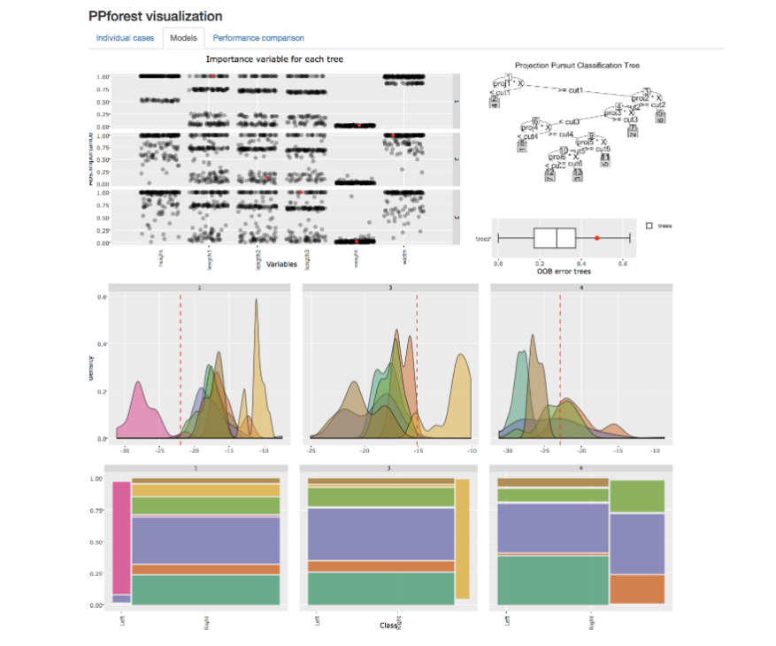

* [Black Hat Visualization](https://idl.cs.washington.edu/files/2017-BlackHatVis-DECISIVe.pdf); Michael Correll, Jeffrey Heer; People lie, mislead, and bullshit in a myriad of ways. Visualizations,as a form of communication, are no exception to these tendencies.Yet, the language we use to describe how people can use visualiza-tions to mislead can be relatively sparse. For instance, one can be“lying with vis” or using “deceptive visualizations.” In this paper, weuse the language of computer security to expand the space of waysthat unscrupulous people (black hats) can manipulate visualizationsfor nefarious ends. In addition to forms of deception well-coveredin the visualization literature, we also focus on visualizations whichhave fidelity to the underlying data (and so may not be considereddeceptive in the ordinary use of the term in visualization), but stillhave negative impact on how data are perceived.  We encouragedesigners to think defensively and comprehensively about how theirvisual designs can result in data being misinterprete.

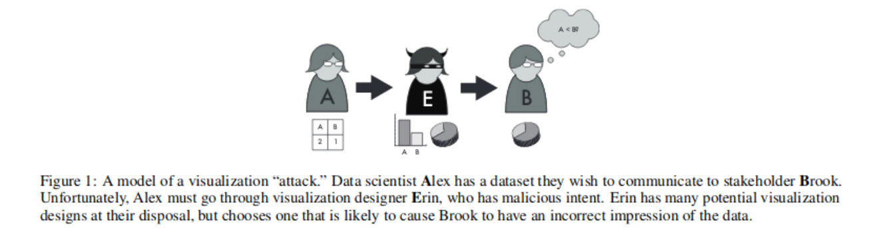

* [A Workflow for Visual Diagnostics of Binary Classifiers using Instance-Level Explanations](https://arxiv.org/abs/1705.01968); Josua Krause, Aritra Dasgupta, Jordan Swartz, Yindalon Aphinyanaphongs, Enrico Bertini; Human-in-the-loop data analysis applications necessitate greater transparency in machine learning models for experts to understand and trust their decisions. To this end, we propose a visual analytics workflow to help data scientists and domain experts explore, diagnose, and understand the decisions made by a binary classifier. The approach leverages "instance-level explanations", measures of local feature relevance that explain single instances, and uses them to build a set of visual representations that guide the users in their investigation. The workflow is based on three main visual representations and steps: one based on aggregate statistics to see how data distributes across correct / incorrect decisions; one based on explanations to understand which features are used to make these decisions; and one based on raw data, to derive insights on potential root causes for the observed patterns. 
* [Fair Forests: Regularized Tree Induction to Minimize Model Bias](https://arxiv.org/pdf/1712.08197.pdf); Edward Raff, Jared Sylvester, Steven Mills; The potential lack of fairness in the outputs of machine learning algorithms has recently gained attention both within the research community as well as in society more broadly. Surprisingly, there is no prior work developing tree-induction algorithms for building fair decision trees or fair random forests. These methods have widespread popularity as they are one of the few to be simultaneously interpretable, non-linear, and easy-to-use. In this paper we develop, to our knowledge, the first technique for the induction of fair decision trees. We show that our "Fair Forest" retains the benefits of the tree-based approach, while providing both greater accuracy and fairness than other alternatives, for both "group fairness" and "individual fairness.'" We also introduce new measures for fairness which are able to handle multinomial and continues attributes as well as regression problems, as opposed to binary attributes and labels only. Finally, we demonstrate a new, more robust evaluation procedure for algorithms that considers the dataset in its entirety rather than only a specific protected attribute.
* [Towards A Rigorous Science of Interpretable Machine Learning](https://arxiv.org/pdf/1702.08608.pdf); Finale Doshi-Velez and Been Kim; In such cases, a popular fallback is the criterion of interpretability: if the system can explain its reasoning, we then can verify whether that reasoning is sound with respect to these auxiliary criteria. Unfortunately, there is little consensus on what interpretability in machine learning is and how to evaluate it for benchmarking. To large extent, both evaluation approaches rely on some notion of “you’ll know it when you see it.” Should we be concerned about a lack of rigor?;  Multi-objective trade-offs: Mismatched objectives: Ethics: Safety: Scientific Understanding:
* [Attentive Explanations: Justifying Decisions and Pointing to the Evidence](https://arxiv.org/pdf/1711.07373.pdf); Dong Huk Park et al; Deep models are the defacto standard in visual decision problems due to their impressive performance on a wide array of visual tasks. We propose two large-scale datasets with annotations that visually and textually justify a classification decision for various activities, i.e. ACT-X, and for question answering, i.e. VQA-X. 
* [SPINE: SParse Interpretable Neural Embeddings](https://arxiv.org/abs/1711.08792); Anant Subramanian, Danish Pruthi, Harsh Jhamtani, Taylor Berg-Kirkpatrick, Eduard Hovy; Prediction without justification has limited utility. Much of the success of neural models can be attributed to their ability to learn rich, dense and expressive representations. While these representations capture the underlying complexity and latent trends in the data, they are far from being interpretable. We propose a novel variant of denoising k-sparse autoencoders that generates highly efficient and interpretable distributed word representations (word embeddings), beginning with existing word representations from state-of-the-art methods like GloVe and word2vec. Through large scale human evaluation, we report that our resulting word embedddings are much more interpretable than the original GloVe and word2vec embeddings. Moreover, our embeddings outperform existing popular word embeddings on a diverse suite of benchmark downstream tasks.
* [Detecting concept drift in data streams using model explanation](https://www.researchgate.net/publication/320177686_Detecting_concept_drift_in_data_streams_using_model_explanation); Jaka Demšar, Zoran Bosnic; Interesting use case for explainers - PDP like explainers are used to identify concept drift.
* [Explanation of Prediction Models with ExplainPrediction](http://www.informatica.si/index.php/informatica/article/view/2227/1121) intoroduces two methods EXPLAIN and IME (R packages) for local and global explanations.
* [What do we need to build explainable AI systems for the medical domain?](https://arxiv.org/pdf/1712.09923.pdf); Andreas Holzinger, Chris Biemann, Constantinos Pattichis, Douglas Kell. In this paper we outline some of our research topics in the context of the relatively new area of explainable-AI with a focus on the application in medicine, which is a very special domain. This is due to the fact that medical professionals are working mostly with distributed heterogeneous and complex sources of data. In this paper we concentrate on three sources: images, omics data and text. We argue that research in explainable-AI would generally help to facilitate the implementation of AI/ML in the medical domain, and specifically help to facilitate transparency and trust.  However, the full effectiveness of all AI/ML success is limited by the algorithm’s inabilities to explain its results to human experts - but exactly this is a big issue in the medical domain.

### 2016 

* [Equality of Opportunity in Supervised Learning](https://arxiv.org/abs/1610.02413); Moritz Hardt, Eric Price, Nathan Srebro; We propose a criterion for discrimination against a specified sensitive attribute in supervised learning, where the goal is to predict some target based on available features. Assuming data about the predictor, target, and membership in the protected group are available, we show how to optimally adjust any learned predictor so as to remove discrimination according to our definition. Our framework also improves incentives by shifting the cost of poor classification from disadvantaged groups to the decision maker, who can respond by improving the classification accuracy.
In line with other studies, our notion is oblivious: it depends only on the joint statistics of the predictor, the target and the protected attribute, but not on interpretation of individualfeatures. We study the inherent limits of defining and identifying biases based on such oblivious measures, outlining what can and cannot be inferred from different oblivious tests.
We illustrate our notion using a case study of FICO credit scores. 
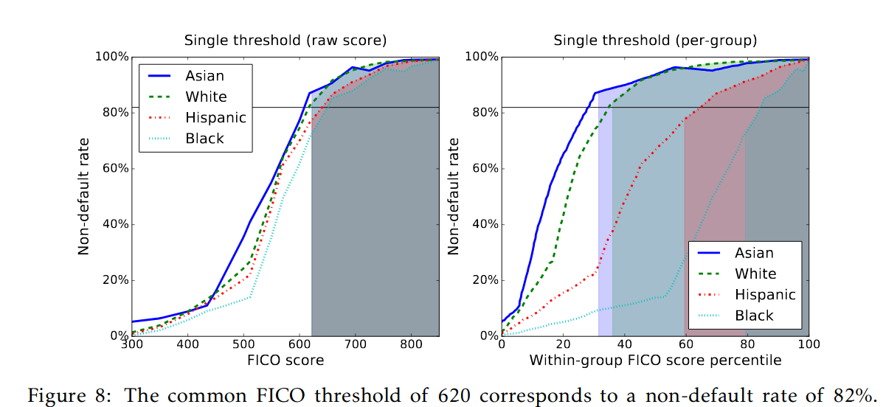

* [Interacting with Predictions: Visual Inspection of Black-box Machine Learning Models](http://perer.org/papers/adamPerer-Prospector-CHI2016.pdf); Josua Krause, Adam Perer, Kenney Ng; Describes Prospector - tool for visual exploration of predictive models. Few interesting and novel ideas, like Partial Dependence Bars. Prospector can compare models and shows both local and global explanations.

* [The Mythos of Model Interpretability](https://arxiv.org/abs/1606.03490); Zachary C. Lipton; Supervised machine learning models boast remarkable predictive capabilities. But can you trust your model? Will it work in deployment? What else can it tell you about the world? We want models to be not only good, but interpretable. And yet the task of interpretation appears underspecified. (...) First, we examine the motivations underlying interest in interpretability, finding them to be diverse and occasionally discordant. Then, we address model properties and techniques thought to confer interpretability, identifying transparency to humans and post-hoc explanations as competing notions. Throughout, we discuss the feasibility and desirability of different notions, and question the oft-made assertions that linear models are interpretable and that deep neural networks are not. 

* [What makes classification trees comprehensible?](https://www.sciencedirect.com/science/article/pii/S0957417416302901); Rok Piltaver, Mitja Luštrek, Matjaž Gams, Sanda Martinčić-Ipšić; Classification trees are attractive for practical applications because of their comprehensibility. However, the literature on the parameters that influence their comprehensibility and usability is scarce. This paper systematically investigates how tree structure parameters (the number of leaves, branching factor, tree depth) and visualisation properties influence the tree comprehensibility. In addition, we analyse the influence of the question depth (the depth of the deepest leaf that is required when answering a question about a classification tree), which turns out to be the most important parameter, even though it is usually overlooked. The analysis is based on empirical data that is obtained using a carefully designed survey with 98 questions answered by 69 respondents. The paper evaluates several tree-comprehensibility metrics and proposes two new metrics (the weighted sum of the depths of leaves and the weighted sum of the branching factors on the paths from the root to the leaves) that are supported by the survey results. The main advantage of the new comprehensibility metrics is that they consider the semantics of the tree in addition to the tree structure itself.

### 2015

* [The Residual-based Predictiveness Curve - A Visual Tool to Assess the Performance of Prediction Models](https://www.ncbi.nlm.nih.gov/pubmed/26676377); Giuseppe Casalicchio, Bernd Bischl, Anne-Laure Boulesteix, Matthias Schmid; The RBP (residual-based predictiveness) curve reflects both the calibration and the discriminatory power of a prediction model. In addition, the curve can be conveniently used to conduct valid performance checks and marker comparisons. The RBP curve is implemented in the R package RBPcurve. 
* [Interpretable classifiers using rules and Bayesian analysis: Building a better stroke prediction model](https://arxiv.org/abs/1511.01644); Benjamin Letham, Cynthia Rudin, Tyler H. McCormick, David Madigan; We aim to produce predictive models that are not only accurate, but are also interpretable to human experts. Our models are decision lists, which consist of a series of if...then... statements (e.g., if high blood pressure, then stroke) that discretize a high-dimensional, multivariate feature space into a series of simple, readily interpretable decision statements. We introduce a generative model called Bayesian Rule Lists that yields a posterior distribution over possible decision lists. It employs a novel prior structure to encourage sparsity.

### 2009

* [How to Explain Individual Classification Decisions](https://arxiv.org/pdf/0912.1128.pdf), David Baehrens, Timon Schroeter, Stefan Harmeling, Motoaki Kawanabe, Katja Hansen, Klaus-Robert Muller; (from abstract) The only method that is currently able to provide such explanations are decision trees. ... Model agnostic method, introduces *explanation vectors* that summarise steepness of changes of model decisions as function of model inputs.

### 2005

* [The Tyranny of Tacit Knowledge: What Artificial Intelligence Tells us About Knowledge Representation
](https://www.researchgate.net/publication/224755645_The_Tyranny_of_Tacit_Knowledge_What_Artificial_Intelligence_Tells_us_About_Knowledge_Representation); Kurt D. Fenstermacher; Polanyi's tacit knowledge captures the idea "we can know more than we can tell." Many researchers in the knowledge management community have used the idea of tacit knowledge to draw a distinction between that which cannot be formally represented (tacit knowledge) and knowledge which can be so represented (explicit knowledge). I argue that the deference that knowledge management researchers give to tacit knowledge hinders potentially fruitful work for two important reasons. First, the inability to explicate knowledge does not imply that the knowledge cannot be formally represented. Second, assuming the inability to formalize tacit knowledge as it exists in the minds of people does not exclude the possibility that computer systems might perform the same tasks using alternative representations. By reviewing work from artificial intelligence, I will argue that a richer model of cognition and knowledge representation is needed to study and build knowledge management systems.

### 2004

* [Discovering additive structure in black box functions](https://dl.acm.org/citation.cfm?doid=1014052.1014122), Giles Hooker

## Books

### 2020

* [Robustness and Explainability of Artificial Intelligence](https://publications.jrc.ec.europa.eu/repository/bitstream/JRC119336/dpad_report.pdf); Hamon Ronan, Junklewitz Henrik, Sanchez Ignacio; From technical to policy solutions; JRC technical report; Technical report by the Joint Research Centre (JRC), the European Commission’s science and knowledge service. 

### 2019

* [Predictive Models: Explore, Explain, and Debug](https://github.com/pbiecek/PM_VEE); Przemyslaw Biecek, Tomasz Burzykowski. Today, the  bottleneck in predictive modelling is not the lack of data, nor the lack of computational power, nor inadequate algorithms, nor the lack of flexible models. It is the lack of tools for model validation, model exploration, and explanation of model decisions. Thus, in this book, we present a collection of methods that may be used for this purpose.

* [Explainable AI: Interpreting, Explaining and Visualizing Deep Learning](https://www.springer.com/gp/book/9783030289539); Samek, W., Montavon, G., Vedaldi, A., Hansen, L.K., Müller, K.-R.; The development of “intelligent” systems that can take decisions and perform autonomously might lead to faster and more consistent decisions. A limiting factor for a broader adoption of AI technology is the inherent risks that come with giving up human control and oversight to “intelligent” machines. For sensitive tasks involving critical infrastructures and affecting human well-being or health, it is crucial to limit the possibility of improper, non-robust and unsafe decisions and actions. Before deploying an AI system, we see a strong need to validate its behavior, and thus establish guarantees that it will continue to perform as expected when deployed in a real-world environment. In pursuit of that objective, ways for humans to verify the agreement between the AI decision structure and their own ground-truth knowledge have been explored. Explainable AI (XAI) has developed as a subfield of AI, focused on exposing complex AI models to humans in a systematic and interpretable manner.
The 22 chapters included in this book provide a timely snapshot of algorithms, theory, and applications of interpretable and explainable AI and AI techniques that have been proposed recently reflecting the current discourse in this field and providing directions of future development. The book is organized in six parts: towards AI transparency; methods for interpreting AI systems; explaining the decisions of AI systems; evaluating interpretability and explanations; applications of explainable AI; and software for explainable AI.

### 2018

* [Machine Learning Interpretability with H2O Driverless AI](http://docs.h2o.ai/driverless-ai/latest-stable/docs/booklets/MLIBooklet.pdf); Patrick Hall, Navdeep Gill, Megan Kurka, Wen Phan; 
* [An Introduction to Machine Learning Interpretability](https://www.oreilly.com/library/view/an-introduction-to/9781492033158/); Navdeep Gill, Patrick Hall; Lots of great figures, high level overview of the most common techniques to the model interpretability.
* [Interpretable Machine Learning](https://christophm.github.io/interpretable-ml-book/); Christoph Molnar; Intoduces the most popular methods (LIME, PDP, SHAP and few others) along with more general bird's-eye view over interpretability. 

## Tools

### 2019
* [ ExplainX ](https://github.com/explainX/explainx); ExplainX is a fast, light-weight, and scalable explainable AI framework for data scientists to explain any black-box model to business stakeholders in just one line of code. This library is maintained by the AI reearchers at New York University VIDA Lab. Detailed documentation can also be found on this [website](https://www.explainx.ai/)

* [ EthicalML / xai ](https://github.com/EthicalML/xai); XAI is a Machine Learning library that is designed with AI explainability in its core. XAI contains various tools that enable for analysis and evaluation of data and models. The XAI library is maintained by The Institute for Ethical AI & ML, and it was developed based on the 8 principles for Responsible Machine Learning. You can find the documentation at https://ethicalml.github.io/xai/index.html. 

* [Aequitas: A Bias and Fairness Audit Toolkit](https://arxiv.org/abs/1811.05577v2); Recent work has raised concerns on the risk of unintended bias in AI systems being used nowadays that can affect individuals unfairly based on race, gender or religion, among other possible characteristics. While a lot of bias metrics and fairness definitions have been proposed in recent years, there is no consensus on which metric/definition should be used and there are very few available resources to operationalize them.  Aequitas facilitates informed and equitable decisions around developing and deploying algorithmic decision making systems for both data scientists, machine learning researchers and policymakers. 

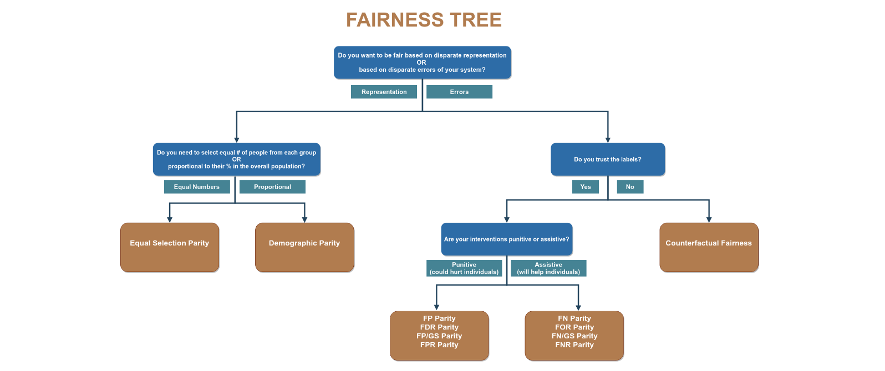

* [tf-explain](https://github.com/sicara/tf-explain); tf-explain implements interpretability methods as Tensorflow 2.0 callbacks to ease neural network's understanding. See [Introducing tf-explain, Interpretability for Tensorflow 2.0](https://blog.sicara.com/tf-explain-interpretability-tensorflow-2-9438b5846e35)

* [XAI library maintained by The Institute for Ethical AI & ML](https://github.com/EthicalML/xai) XAI is a Machine Learning library that is designed with AI explainability in its core. XAI contains various tools that enable for analysis and evaluation of data and models. The XAI library is maintained by The Institute for Ethical AI & ML, and it was developed based on the [8 principles for Responsible Machine Learning](https://ethical.institute/principles.html).

* [InterpretML by Microsoft](https://github.com/microsoft/interpret); Python library by Microsoft related to explainability of ML models

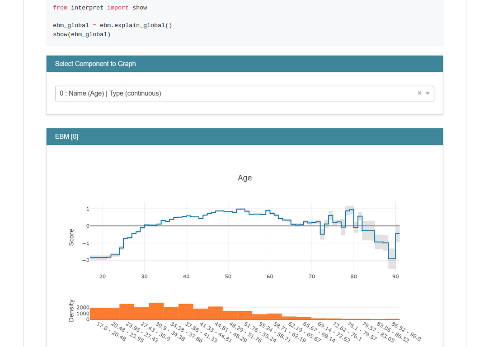

* [Assessing Causality from Observational Data using Pearl's Structural Causal Models](https://blog.methodsconsultants.com/posts/pearl-causality/); 
* [sklearn_explain](https://github.com/antoinecarme/sklearn_explain); Model explanation provides the ability to interpret the effect of the predictors on the composition of an individual score.
* [heatmapping.org](http://www.heatmapping.org/); This webpage aims to regroup publications and software produced as part of a joint project at Fraunhofer HHI, TU Berlin and SUTD Singapore on developing new method to understand nonlinear predictions of state-of-the-art machine learning models. Machine learning models, in particular deep neural networks (DNNs), are characterized by very high predictive power, but in many case, are not easily interpretable by a human. Interpreting a nonlinear classifier is important to gain trust into the prediction, and to identify potential data selection biases or artefacts. The project studies in particular techniques to decompose the prediction in terms of contributions of individual input variables such that the produced decomposition (i.e. explanation) can be visualized in the same way as the input data.

* [iNNvestigate neural networks!](https://github.com/albermax/innvestigate); A toolbox created by authors of [heatmapping.org](http://www.heatmapping.org/) in the attempt to understand neural networks better. It contains implementations of e.g., Saliency, Deconvnet, GuidedBackprop, SmoothGrad, IntergratedGradients, LRP, PatternNet&-Attribution. This library provides a common interface and out-of-the-box implementation for many analysis methods. 

* [ggeffects](https://strengejacke.wordpress.com/2019/01/14/ggeffects-0-8-0-now-on-cran-marginal-effects-for-regression-models-rstats/); Daniel Lüdecke; Compute marginal effects from statistical models and returns the result as tidy data frames. These data frames are ready to use with the 'ggplot2'-package. Marginal effects can be calculated for many different models. Interaction terms, splines and polynomial terms are also supported. The main functions are ggpredict(), ggemmeans() and ggeffect(). There is a generic plot()-method to plot the results using 'ggplot2'.

* [Contrastive LRP](https://github.com/Jindong-Explainable-AI/Contrastive-LRP) - A pytorch implemention of the paper [Understanding Individual Decisions of CNNs via Contrastive Backpropagation](https://arxiv.org/pdf/1812.02100.pdf). The code creates CLRP saliency maps to explain individual classification on VGG16 model.

* [Relative Attributing Propagation](https://github.com/wjNam/Relative_Attributing_Propagation) - Relative attributing propagation (RAP) decomposes the output predictions of DNNs with a new perspective of separating the relevant (positive) and irrelevant (negative) attributions according to the relative influence between the layers. Detail description of this method is provided in the paper https://arxiv.org/pdf/1904.00605.pdf.

### 2018

* [KDD 2018: Explainable Models for Healthcare AI](https://notepad.mmakowski.com/Tech/KDD%202018:%20Explainable%20Models%20for%20Healthcare%20AI); The Explainable Models for Healthcare AI tutorial was presented by a trio from KenSci Inc. that included a data scientist and a clinician. The premise of the session was that explainability is particularly important in healthcare applications of machine learning, due to the far-reaching consequences of decisions, high cost of mistakes, fairness and compliance requirements. The tutorial walked through a number of aspects of interpretability and discussed techniques that can be applied to explain model predictions.
* [MAGMIL: Model Agnostic Methods for Interpretable Machine Learning](https://github.com/ankitbit/MAGMIL); European Union’s new General Data Protection Regulation which is going to be enforced beginning from 25th of May, 2018 will have potential impact on the routine use of machine learning algorithms by restricting automated individual decision-making (that is, algorithms that make decisions based on user-level predictors) which ”significantly affect” users. The law will also effectively create a ”right to explanation,” whereby a user can ask for an explanation of an algorithmic decision that was made about them. Considering such challenging norms on the use of machine learning systems, we are making an attempt to make the models more interpretable. While we are concerned about developing a deeper understanding of decisions made by a machine learning model, the idea of extracting the explaintations from the machine learning system, also known as model-agnostic interpretability methods has some benefits over techniques such as model specific interpretability methods in terms of flexibility.
* [A toolbox to iNNvestigate neural networks' predictions!](https://github.com/albermax/innvestigate); Maximilian Alber; In the recent years neural networks furthered the state of the art in many domains like, e.g., object detection and speech recognition. Despite the success neural networks are typically still treated as black boxes. Their internal workings are not fully understood and the basis for their predictions is unclear. In the attempt to understand neural networks better several methods were proposed, e.g., Saliency, Deconvnet, GuidedBackprop, SmoothGrad, IntergratedGradients, LRP, PatternNet&-Attribution. Due to the lack of a reference implementations comparing them is a major effort. This library addresses this by providing a common interface and out-of-the-box implementation for many analysis methods. Our goal is to make analyzing neural networks' predictions easy!
* [Black Box Auditing and Certifying and Removing Disparate Impact](https://github.com/algofairness/BlackBoxAuditing); This repository contains a sample implementation of Gradient Feature Auditing (GFA) meant to be generalizable to most datasets. For more information on the repair process, see our paper on Certifying and Removing Disparate Impact. For information on the full auditing process, see our paper on Auditing Black-box Models for Indirect Influence.
* [Skater: Python Library for Model Interpretation/Explanations](https://github.com/datascienceinc/Skater); Skater is a unified framework to enable Model Interpretation for all forms of model to help one build an Interpretable machine learning system often needed for real world use-cases(** we are actively working towards to enabling faithful interpretability for all forms models). It is an open source python library designed to demystify the learned structures of a black box model both globally(inference on the basis of a complete data set) and locally(inference about an individual prediction).
* [Weight Watcher](https://github.com/CalculatedContent/WeightWatcher); Charles Martin; Weight Watcher analyzes the Fat Tails in the weight matrices of Deep Neural Networks (DNNs). This tool can predict the trends in the generalization accuracy of a series of DNNs, such as VGG11, VGG13, ..., or even the entire series of ResNet models--without needing a test set ! This relies upon recent research into the Heavy (Fat) Tailed Self Regularization in DNNs 
* [Adversarial Robustness Toolbox - ART](https://github.com/IBM/adversarial-robustness-toolbox); This is a library dedicated to adversarial machine learning. Its purpose is to allow rapid crafting and analysis of attacks and defense methods for machine learning models. The Adversarial Robustness Toolbox provides an implementation for many state-of-the-art methods for attacking and defending classifiers.
* [Model Describer](https://github.com/DataScienceSquad/model-describer); Python script that generates html report that summarizes predictive models. Interactive and rich in descriptions.
* [AI Fairness 360](https://github.com/IBM/aif360); Python library developed by IBM to help detect and remove bias in machine learning models. [Some introduction](https://arxiv.org/abs/1810.01943)
* [The What-If Tool: Code-Free Probing of Machine Learning Models](https://ai.googleblog.com/2018/09/the-what-if-tool-code-free-probing-of.html); An interactive tool for What-If scenarios developed in Google, part of TensorBoard.

### 2017

* [Impact encoding for categorical features](https://github.com/Dpananos/Categorical-Features); Imagine working with a dataset containing all the zip codes in the United States. That is a datset containing nearly 40,000 unique categories. How would you deal with that kind of data if you planned to do predictive modelling? One hot encoding doesn't get you anywhere useful, since that would add 40,000 sparse variables to your dataset. Throwing the data out could be leaving valuable information on the table, so that doesn't seem right either. In this post, I'm going to examine how to deal with categorical variables with high cardinality using a stratey called impact encoding. To illustrate this example, I use a data set containing used car sales. The probelm is especially well suited because there are several categorical features with many levels. Let's get started.
* [FairTest](https://github.com/columbia/fairtest); FairTest enables developers or auditing entities to discover and test for unwarranted associations between an algorithm's outputs and certain user subpopulations identified by protected features.
* [Explanation Explorer](https://github.com/nyuvis/explanation_explorer); Visual tool implemented in python for visual diagnostics of binary classifiers using lnstance-level explanations (local explainers).
* [ggeffects](https://strengejacke.wordpress.com/2017/05/24/ggeffects-create-tidy-data-frames-of-marginal-effects-for-ggplot-from-model-outputs-rstats/); Create Tidy Data Frames of Marginal Effects for ‚ggplot‘ from Model Outputs, The aim of the ggeffects-package is similar to the broom-package: transforming “untidy” input into a tidy data frame, especially for further use with ggplot. However, ggeffects does not return model-summaries; rather, this package computes marginal effects at the mean or average marginal effects from statistical models and returns the result as tidy data frame (as tibbles, to be more precisely).

## Articles

### 2019

* [AI Black Box Horror Stories — When Transparency was Needed More Than Ever](https://medium.com/@ODSC/ai-black-box-horror-stories-when-transparency-was-needed-more-than-ever-3d6ac0439242) Arguably, one of the biggest debates happening in data science in 2019 is the need for AI explainability. The ability to interpret machine learning models is turning out to be a defining factor for the acceptance of statistical models for driving business decisions. Enterprise stakeholders are demanding transparency in how and why these algorithms are making specific predictions. A firm understanding of any inherent bias in machine learning keeps boiling up to the top of requirements for data science teams. As a result, many top vendors in the big data ecosystem are launching new tools to take a stab at resolving the challenge of opening the AI “black box.”

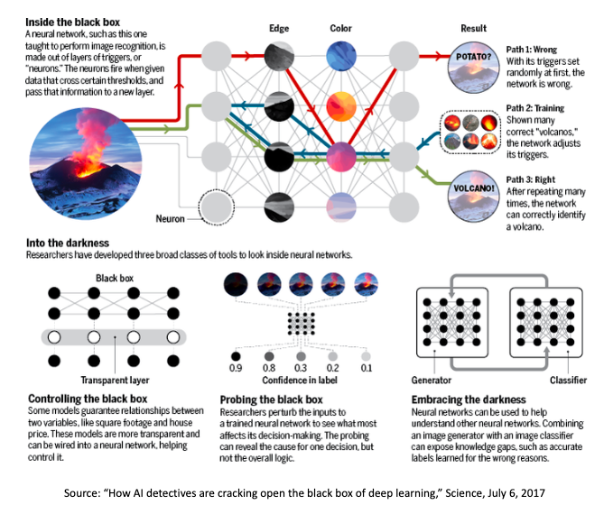

* [Artificial Intelligence Confronts a 'Reproducibility' Crisis](https://www.wired.com/story/artificial-intelligence-confronts-reproducibility-crisis/); A few years ago, Joelle Pineau, a computer science professor at McGill, was helping her students design a new algorithm when they fell into a rut. Her lab studies reinforcement learning, a type of artificial intelligence that’s used, among other things, to help virtual characters (“half cheetah” and “ant” are popular) teach themselves how to move about in virtual worlds. It’s a prerequisite to building autonomous robots and cars. Pineau’s students hoped to improve on another lab’s system. But first they had to rebuild it, and their design, for reasons unknown, was falling short of its promised results. Until, that is, the students tried some “creative manipulations” that didn’t appear in the other lab’s paper.
* [Model explainers and the press secretary — directly optimizing for trust in machine learning may be harmful](https://medium.com/@stuart.reynolds/model-explainers-and-the-press-secretary-optimizing-for-trust-in-machine-learning-may-be-harmful-84275b27bea6); If black-box model explainers optimize human trust in machine learning models, why shouldn’t we expect that black-box model explainers will function like a dishonest government Press Secretary?
* [Decoding the Black Box: An Important Introduction to Interpretable Machine Learning Models in Python](https://www.analyticsvidhya.com/blog/2019/08/decoding-black-box-step-by-step-guide-interpretable-machine-learning-models-python/); Ankit Choudhary; Interpretable machine learning is a critical concept every data scientist should be aware of; How can you build interpretable machine learning models? This article will provide a framework; We will also code these interpretable machine learning models in Python

* [I, Black Box: Explainable Artificial Intelligence and the Limits of Human Deliberative Processes](https://warontherocks.com/2019/07/i-black-box-explainable-artificial-intelligence-and-the-limits-of-human-deliberative-processes/); Much has been made about the importance of understanding the inner workings of machines when it comes to the ethics of using artificial intelligence (AI) on the battlefield. Delegates at the Group of Government Expert meetings on lethal autonomous weapons continue to raise the issue. Concerns expressed by legal and scientific scholars abound. One commentator sums it up: “for human decision makers to be able to retain agency over the morally relevant decisions made with AI they would need a clear insight into the AI black box, to understand the data, its provenance and the logic of its algorithms.”
* [Teaching AI, Ethics, Law and Policy](https://arxiv.org/abs/1904.12470); Asher Wilk; The cyberspace and the development of intelligent systems using Artificial Intelligence (AI) created new challenges to computer professionals, data scientists, regulators and policy makers. For example, self-driving cars raise new technical, ethical, legal and policy issues. This paper proposes a course Computers, Ethics, Law, and Public Policy, and suggests a curriculum for such a course. This paper presents ethical, legal, and public policy issues relevant to building and using software and artificial intelligence. It describes ethical principles and values relevant to AI systems. 
* [An introduction to explainable AI, and why we need it](https://www.kdnuggets.com/2019/04/introduction-explainable-ai.html); Patrick Ferris; I was fortunate enough to attend the Knowledge Discovery and Data Mining(KDD) conference this year. Of the talks I went to, there were two main areas of research that seem to be on a lot of people’s minds: Firstly, finding a meaningful representation of graph structures to feed into neural networks. Oriol Vinyalsfrom DeepMind gave a talk about their Message Passing Neural Networks.  The second area, and the focus of this article, are explainable AI models. As we generate newer and more innovative applications for neural networks, the question of ‘How do they work?’ becomes more and more important.
* [The AI Black Box Explanation Problem](https://ercim-news.ercim.eu/en116/special/the-ai-black-box-explanation-problem); At a very high level, we articulated the problem in two different flavours: eXplanation by Design (XbD): given a dataset of training decision records, how to develop a machine learning decision model together with its explanation; Black Box eXplanation (BBX): given the decision records produced by a black box decision model, how to reconstruct an explanation for it.
* [VOZIQ Launches ‘Agent Connect,’ an Explainable AI Product to Enable Large-Scale Customer Retention Programs](https://www.einnews.com/pr_news/481152181/voziq-launches-agent-connect-an-explainable-ai-product-to-enable-large-scale-customer-retention-programs); RESTON, VIRGINIA , USA, April 3, 2019 /EINPresswire.com/ -- VOZIQ, an enterprise cloud-based application solution provider that enables recurring revenue businesses to drive large-scale predictive customer retention programs, announced the launch of its new eXplainable AI (XAI) product ‘Agent Connect’ to help businesses enhance proactive retention capabilities of their most critical resource – customer retention agents. ‘Agent Connect’ is VOZIQ’s newest product powered by next-generation eXplainable AI (XAI) that brings together multiple retention risk signals with expressed and inferred needs, sentiment, churn drivers and behaviors that lead to attrition of customers discovered directly from millions of customer interactions by analyzing unstructured and structured customer data, and converts insights those into easy-to-act, prescriptive intelligence about predicted health for any customer.
* [Derisking machine learning and artificial intelligence ](https://www.mckinsey.com/business-functions/risk/our-insights/derisking-machine-learning-and-artificial-intelligence); Machine learning and artificial intelligence are set to transform the banking industry, using vast amounts of data to build models that improve decision making, tailor services, and improve risk management. According to the McKinsey Global Institute, this could generate value of more than $250 billion in the banking industry. But there is a downside, since machine-learning models amplify some elements of model risk. And although many banks, particularly those operating in jurisdictions with stringent regulatory requirements, have validation frameworks and practices in place to assess and mitigate the risks associated with traditional models, these are often insufficient to deal with the risks associated with machine-learning models. Conscious of the problem, many banks are proceeding cautiously, restricting the use of machine-learning models to low-risk applications, such as digital marketing. Their caution is understandable given the potential financial, reputational, and regulatory risks. Banks could, for example, find themselves in violation of antidiscrimination laws, and incur significant fines—a concern that pushed one bank to ban its HR department from using a machine-learning résumé screener. A better approach, however, and ultimately the only sustainable one if banks are to reap the full benefits of machine-learning models, is to enhance model-risk management.
* [Explainable AI should help us avoid a third 'AI winter'](https://www.computing.co.uk/ctg/opinion/3073390/explainable-ai-should-help-us-avoid-a-third-ai-winter); The General Data Protection Regulation (GDPR) that came into force last year across Europe has rightly made consumers and businesses more aware of personal data. However, there is a real risk that through over-correcting around data collection critical AI development will be negatively impacted. This is not only an issue for data scientists, but also those companies that use AI-based solutions to increase competitiveness. The potential negative impact would not only be on businesses implementing AI but also on consumers who may miss out on the benefits AI could bring to the products and services they rely on.
* [Explainable AI: From Prediction To Understanding](https://medium.com/@ODSC/explainable-ai-from-prediction-to-understanding-38c81c11460); It’s not enough to make predictions. Sometimes, you need to generate a deep understanding. Just because you model something doesn’t mean you really know how it works. In classical machine learning, the algorithm spits out predictions, but in some cases, this isn’t good enough. Dr. George Cevora explains why the black box of AI may not always be appropriate and how to go from prediction to understanding.
* [Why Explainable AI (XAI) is the future of marketing and e-commerce](https://www.the-future-of-commerce.com/2019/03/11/what-is-explainable-ai-xai/); “New machine-learning systems will have the ability to explain their rationale, characterize their strengths and weaknesses, and convey an understanding of how they will behave in the future.” – David Gunning, Head of DARPA. As machine learning begins to play a greater role in the delivery of personalized customer experiences in commerce and content, one of the most powerful opportunities is the development of systems that offer marketers the ability to maximize every dollar spent on marketing programs via actionable insights. But the rise of AI in business for actionable insights also creates a challenge: How can marketers know and trust the reasoning behind why an AI system is making recommendations for action? Because AI makes decisions using incredibly complex processes, its decisions are often opaque to the end-user.
* [Interpretable AI or How I Learned to Stop Worrying and Trust AI](https://towardsdatascience.com/interpretable-ai-or-how-i-learned-to-stop-worrying-and-trust-ai-e61f9e8ee2c2) Techniques to build Robust, Unbiased AI Applications; Ajay Thampi; In the last five years alone, AI researchers have made significant breakthroughs in areas such as image recognition, natural language understanding and board games! As companies are considering handing over critical decisions to AI in industries like healthcare and finance, the lack of understanding of complex machine learned models is hugely problematic. This lack of understanding could result in models propagating bias and we’ve seen quite a few examples of this in criminal justice, politics, retail, facial recognition and language understanding.
* [In Search of Explainable Artificial Intelligence](https://www.geopoliticalmonitor.com/in-search-of-explainable-artificial-intelligence/); Today, if a new entrepreneur wants to understand why the banks rejected a loan application for his start-up, or if a young graduate wants to know why the large corporation for which he was hoping to work did not invite her for an interview, they will not be able to discover the reasons that led to these decisions. Both the bank and the corporation used artificial intelligence (AI) algorithms to determine the outcome of the loan or the job application. In practice, this means that if your loan application is rejected, or your CV rejected, no explanation can be provided. This produces an embarrassing scenario, which tends to relegate AI technologies to suggesting solutions, which must be validated by human beings.
* [Explainable AI and the Rebirth of Rules](https://www.forbes.com/sites/tomdavenport/2019/03/18/explainable-ai-and-the-rebirth-of-rules/); Artificial intelligence (AI) has been described as a set of “prediction machines.” In general, the technology is great at generating automated predictions. But if you want to use artificial intelligence in a regulated industry, you better be able to explain how the machine predicted a fraud or criminal suspect, a bad credit risk, or a good candidate for drug trials. International law firm Taylor Wessing (the firm) wanted to use AI as a triage tool to help advise clients of the firm about their predicted exposure to regulations such as the Modern Slavery Act or the Foreign Corrupt Practices Act.  Clients often have suppliers or acquisitions around the world, and they need systematic due diligence to determine where they should investigate more deeply into possible risk. Supply chains can be especially complicated with hundreds of small suppliers. Rumors of Rule Engines’ Death Have Been Greatly Exaggerated
* [Attacking discrimination with smarter machine learning](https://research.google.com/bigpicture/attacking-discrimination-in-ml/); Here we discuss "threshold classifiers," a part of some machine learning systems that is critical to issues of discrimination. A threshold classifier essentially makes a yes/no decision, putting things in one category or another. We look at how these classifiers work, ways they can potentially be unfair, and how you might turn an unfair classifier into a fairer one. As an illustrative example, we focus on loan granting scenarios where a bank may grant or deny a loan based on a single, automatically computed number such as a credit score. 
* [Better Preference Predictions: Tunable and Explainable Recommender Systems](https://blog.insightdatascience.com/tunable-and-explainable-recommender-systems-cd52b6287bad); Amber Roberts; Ad recommendations should be understandable to the individual consumer, but is it possible to increase interpretability without sacrificing accuracy?
* [Machine Learning is Creating a Crisis in Science](https://www.governmentciomedia.com/machine-learning-creating-crisis-science); Kevin McCaney; The adoption of machine-learning techniques is contributing to a worrying number of research findings that cannot be repeated by other researchers.
* [Artificial Intelligence and Ethics](https://harvardmagazine.com/2019/01/artificial-intelligence-limitations); Jonathan Shaw; On march 2018, at around 10 P.M., Elaine Herzberg was wheeling her bicycle across a street in Tempe, Arizona, when she was struck and killed by a self-driving car. Although there was a human operator behind the wheel, an autonomous system—artificial intelligence—was in full control. This incident, like others involving interactions between people and AI technologies, raises a host of ethical and proto-legal questions. What moral obligations did the system’s programmers have to prevent their creation from taking a human life? And who was responsible for Herzberg’s death? The person in the driver’s seat? The company testing the car’s capabilities? The designers of the AI system, or even the manufacturers of its onboard sensory equipment?
* [Building Trusted Human-Machine Partnerships](https://www.darpa.mil/news-events/2019-01-31); A key ingredient in effective teams – whether athletic, business, or military – is trust, which is based in part on mutual understanding of team members’ competence to fulfill assigned roles. When it comes to forming effective teams of humans and autonomous systems, humans need timely and accurate insights about their machine partners’ skills, experience, and reliability to trust them in dynamic environments. At present, autonomous systems cannot provide real-time feedback when changing conditions such as weather or lighting cause their competency to fluctuate. The machines’ lack of awareness of their own competence and their inability to communicate it to their human partners reduces trust and undermines team effectiveness.
* [HOW AUGMENTED ANALYTICS AND EXPLAINABLE AI WILL CAUSE A DISRUPTION IN 2019 & BEYOND](https://www.analyticsinsight.net/here-is-how-augmented-analytics-and-explainable-ai-will-cause-a-disruption-in-2019-beyond/); Kamalika Some; Artificial intelligence (AI) is a transformational $15 trillion opportunity which has caught the attention of all tech users, leaders and influencers. Yet, as AI becomes more sophisticated, the algorithmic ‘black box’ dominates more to make all the decisions. To have a confident outcome and stakeholder trust with an ultimate aim to capitalise on the opportunities, it is essential to know the rationale of how the algorithm arrived at its recommendation or decision, the basic premise behind Explainable AI (XAI).
* [Why ‘Explainable AI’ is the Next Frontier in Financial Crime Fighting ](http://www.bankingexchange.com/news-feed/item/7785-why-explainable-ai-is-the-next-frontier-in-financial-crime-fighting); Chad Hetherington; Financial institutions (FIs) must manage compliance budgets without losing sight of primary functions and quality control. To answer this, many have made the move to automating time-intensive, rote tasks like data gathering and sorting through alerts by adopting innovative technologies like AI and machine learning to free up time-strapped analysts for more informed and precise decision-making processes.
* [Machine Learning Interpretability: Do You Know What Your Model Is Doing?](https://www.inovex.de/blog/machine-learning-interpretability/); Marcel Spitzer; With the adoption of GDPR, there are now EU-wide regulations concerning automated individual decision-making and profiling (Art. 22, also termed „right to explanation“), engaging companies to give individuals information about processing, to introduce ways for them to request intervention and to even carry out regular checks to make sure that the systems are working as intended. 
* [Building explainable machine learning models](https://www.fastdatascience.com/2019/02/08/building-explainable-machine-learning-models/); Thomas Wood; Sometimes as data scientists we will encounter cases where we need to build a machine learning model that should not be a black box, but which should make transparent decisions that humans can understand. This can go against our instincts as scientists and engineers, as we would like to build the most accurate model possible.
* [AI is not IT](https://www.linkedin.com/pulse/ai-silvie-spreeuwenberg); Silvie Spreeuwenberg; XAI suggests something in between. It is still narrow AI but used in such a way that there is a feedback loop to the environment. The feedback loop may involve human intervention. We understand the scope of the narrow AI solution. We can adjust the solution when the task at hand requires more knowledge, or are warned in a meaningful way when the task at hand does not fit in the scope of the AI solution.
* [A computer program used for bail and sentencing decisions was labeled biased against blacks. It’s actually not that clear.](https://www.washingtonpost.com/news/monkey-cage/wp/2016/10/17/can-an-algorithm-be-racist-our-analysis-is-more-cautious-than-propublicas/); This past summer, a heated debate broke out about a tool used in courts across the country to help make bail and sentencing decisions. It’s a controversy that touches on some of the big criminal justice questions facing our society. And it all turns on an algorithm.
* [AAAS: Machine learning 'causing science crisis'](https://www.bbc.com/news/science-environment-47267081); Machine-learning techniques used by thousands of scientists to analyse data are producing results that are misleading and often completely wrong. Dr Genevera Allen from Rice University in Houston said that the increased use of such systems was contributing to a “crisis in science”. She warned scientists that if they didn’t improve their techniques they would be wasting both time and money.
* [Automatic Machine Learning is broken](https://pplonski.github.io/automatic-machine-learning-is-broken/); Debt that comes with maintenance and understand of complex models 
* [Charles River Analytics creates tool to help AI communicate effectively with humans](http://mil-embedded.com/news/charles-river-analytics-creates-tool-to-help-ai-communicate-effectively-with-humans/); Developer of intelligent systems solutions, Charles River Analytics Inc. created the Causal Models to Explain Learning (CAMEL) approach under the Defense Advanced Research Projects Agency's (DARPA) Explainable Artificial Intelligence (XAI) effort. The goal of the CAMEL tool approach will be help artificial intelligence effectively communicate with human teammates.
* [Inside DARPA’s effort to create explainable artificial intelligence](https://bdtechtalks.com/2019/01/10/darpa-xai-explainable-artificial-intelligence/); Among DARPA’s many exciting projects is Explainable Artificial Intelligence (XAI), an initiative launched in 2016 aimed at solving one of the principal challenges of deep learning and neural networks, the subset of AI that is becoming increasing prominent in many different sectors.
* [Boston University researchers develop framework to improve AI fairness](https://venturebeat.com/2019/01/30/boston-university-researchers-develop-framework-to-improve-ai-fairness/); Experience in the past few years shows AI algorithms can manifest gender and racial bias, raising concern over their use in critical domains, such as deciding whose loan gets approved, who’s qualified for a job, who gets to walk free and who stays in prison. New research by scientists at Boston University shows just how hard it is to evaluate fairness in AI algorithms and tries to establish a framework for detecting and mitigating problematic behavior in automated decisions. Titled “From Soft Classifiers to Hard Decisions: How fair can we be?,” the research paper is being presented this week at the Association for Computing Machinery conference on Fairness, Accountability, and Transparency (ACM FAT*).

### 2018

* [Understanding Explainable AI](https://www.quantiply.com/blog/understanding-explainable-ai); (Extracted from The Basis Technology Handbook for Integrating AI in Highly Regulated Industries) For the longest time, the public perception of AI has been linked to visions of the apocalypse: AI is Skynet, and we should be afraid of it. You can see that fear in the reactions to the Uber self-driving car tragedy. Despite the fact that people cause tens of thousands of automobile deaths per year, it strikes a nerve when even a single accident involves AI. This fear belies something very important about the technical infrastructure of the modern world: AI is already thoroughly baked in. That’s not to say that there aren’t reasons to get skittish about our increasing reliance on AI technology. The “black box” problem is one such justified reason for hesitation.
* [The Importance of Human Interpretable Machine Learning](https://towardsdatascience.com/human-interpretable-machine-learning-part-1-the-need-and-importance-of-model-interpretation-2ed758f5f476); This article is the first in my series of articles aimed at ‘Explainable Artificial Intelligence (XAI)’. The field of Artificial Intelligence powered by Machine Learning and Deep Learning has gone through some phenomenal changes over the last decade. Starting off as just a pure academic and research-oriented domain, we have seen widespread industry adoption across diverse domains including retail, technology, healthcare, science and many more. Rather than just running lab experiments to publish a research paper, the key objective of data science and machine learning in the 21st century has changed to tackling and solving real-world problems, automating complex tasks and making our life easier and better. More than often, the standard toolbox of machine learning, statistical or deep learning models remain the same. New models do come into existence like Capsule Networks, but industry adoption of the same usually takes several years. Hence, in the industry, the main focus of data science or machine learning is more ‘applied’ rather than theoretical and effective application of these models on the right data to solve complex real-world problems is of paramount importance.
* [Uber Has Open-Sourced Autonomous Vehicle Visualization](https://www.designnews.com/design-hardware-software/uber-has-open-sourced-autonomous-vehicle-visualization/38672905960296); With an open source version of its Autonomous Visualization System, Uber is hoping to create a standard visualization system for engineers to use in autonomous vehicle development.
* [Holy Grail of AI for Enterprise - Explainable AI (XAI)](https://blog.goodaudience.com/holy-grail-of-ai-for-enterprise-explainable-ai-xai-6e630902f2a0); Saurabh Kaushik; Apart from a solution of the above scenarios, XAI offers deeper Business benefits, such as:  Improves AI Model performance as explanation help pinpoint issues in data and feature behaviors. Better Decision Making as explanation provides added info and confidence for Man-in-Middle to act wisely and decisively. Gives a sense of Control as an AI system owner clearly knows levers for its AI system’s behavior and boundary. Gives a sense of Safety as each decision can be subjected to pass through safety guidelines and alerts on its violation. Build Trust with stakeholders who can see through all the reasoning of each and every decision made. Monitor for Ethical issues and violation due to bias in training data. Better mechanism to comply with Accountability requirements within the organization for auditing and other purposes. Better adherence to Regulatory requirements (like GDPR) where ‘Right to Explain’ is must-have for a system.
* [Artificial Intelligence Is Not A Technology](https://www.forbes.com/sites/cognitiveworld/2018/11/01/artificial-intelligence-is-not-a-technology/);  Kathleen Walch; Making intelligent machines is both the goal of AI as well as the underlying science behind understanding what it takes to make a machine intelligent. AI represents our desired outcome and many of the developments along the way of that understanding such as self-driving vehicles, image recognition technology, or natural language processing and generation are steps along the journey to AGI.
* [The Building Blocks of Interpretability](https://distill.pub/2018/building-blocks/); Chris Olah ...; Interpretability techniques are normally studied in isolation. We explore the powerful interfaces that arise when you combine them — and the rich structure of this combinatorial space
* [Why Machine Learning Interpretability Matters](https://blog.dataiku.com/why-machine-learning-interpretability-matters); Even though machine learning (ML) has been around for decades, it seems that in the last year, much of the news (notably in mainstream media) surrounding it has turned to interpretability - including ideas like trust, the ML black box, and fairness or ethics. Surely, if the topic is growing in popularity, that must mean it’s important. But why, exactly - and to whom?
* [IBM, Harvard develop tool to tackle black box problem in AI translation](https://venturebeat.com/2018/11/01/ibm-harvard-develop-tool-to-tackle-black-box-problem-in-ai-translation/); seq2seq vis; Researchers at IBM and Harvard University have developed a new debugging tool to address this issue. Presented at the IEEE Conference on Visual Analytics Science and Technology in Berlin last week, the tool lets creators of deep learning applications visualize the decision-making an AI makes when translating a sequence of words from one language to another.
* [The Five Tribes of Machine Learning Explainers](https://www.slideshare.net/lopusz/the-five-tribes-of-machine-learning-explainers); Michał Łopuszyński; Lightning talk from PyData Berlin 2018
* [Beware Default Random Forest Importances](https://explained.ai/rf-importance/index.html); Terence Parr, Kerem Turgutlu, Christopher Csiszar, and Jeremy Howard; TL;DR: The scikit-learn Random Forest feature importance and R's default Random Forest feature importance strategies are biased. To get reliable results in Python, use permutation importance, provided here and in our rfpimp package (via pip). For R, use importance=T in the Random Forest constructor then type=1 in R's importance() function. In addition, your feature importance measures will only be reliable if your model is trained with suitable hyper-parameters.
* [A Case For Explainable AI & Machine Learning](https://www.kdnuggets.com/2018/12/explainable-ai-machine-learning.html); Very nice list of possible use-cases for XAI, examples: Energy theft detection - Different types of theft require different action by the investigators; Credit scoring - he Fair Credit Reporting Act (FCRA) is a federal law that regulates credit reporting agencies and compels them to insure the information they gather and distribute is a fair and accurate summary of a consumer's credit history; Video threat detection - Flagging an individual as a threat has a potential for significant legal implications; 

* [Ethics of AI: A data scientist’s perspective](https://medium.com/@QuantumBlack/ethics-of-ai-a-data-scientists-perspective-cb7cdb1c8392); QuantumBlack

* [Explainable AI vs Explaining AI](https://medium.com/@ahmad.hajmosa/explainable-ai-vs-explaining-ai-part-1-d39ea5053347); Ahmad Haj Mosa; Some ideas that links tools for XAI with ideas from ,,Thinking fast, thinking slow''.

* [Regulating Black-Box Medicine](http://michiganlawreview.org/regulating-black-box-medicine/); Data drive modern medicine. And our tools to analyze those data are growing ever more powerful. As health data are collected in greater and greater amounts, sophisticated algorithms based on those data can drive medical innovation, improve the process of care, and increase efficiency. Those algorithms, however, vary widely in quality. Some are accurate and powerful, while others may be riddled with errors or based on faulty science. When an opaque algorithm recommends an insulin dose to a diabetic patient, how do we know that dose is correct? Patients, providers, and insurers face substantial difficulties in identifying high-quality algorithms; they lack both expertise and proprietary information. How should we ensure that medical algorithms are safe and effective?

* [3 Signs of a Good AI Model](https://tdwi.org/articles/2018/11/26/adv-all-3-signs-of-a-good-ai-model.aspx); Troy Hiltbrand; Until recently, the success of an AI project was judged only by its outcomes for the company, but an emerging industry trend suggests another goal -- explainable artificial intelligence (XAI). The gravitation toward XAI stems from demand from consumers (and ultimately society) to better understand how AI decisions are made. Regulations, such as the General Data Protection Regulation (GDPR) in Europe, have increased the demand for more accountability when AI is used to make automated decisions, especially in cases where bias has a detrimental effect on individuals.

* [Rapid new advances are now underway in AI](https://www.technative.io/why-its-important-to-create-a-movement-around-explainable-ai/); Yet, as AI gets more widely deployed, the importance of having explainable models will increase. Simply, if systems are responsible for making a decision, there comes a step in the process whereby that decision has to be shown — communicating what the decision is, how it was made and – now – why did the AI do what it did.

* [Why We Need to Audit Algorithms](https://hbr.org/2018/11/why-we-need-to-audit-algorithms); James Guszcza Iyad Rahwan Will Bible Manuel Cebrian Vic Katyal; Algorithmic decision-making and artificial intelligence (AI) hold enormous potential and are likely to be economic blockbusters, but we worry that the hype has led many people to overlook the serious problems of introducing algorithms into business and society. Indeed, we see many succumbing to what Microsoft’s Kate Crawford calls “data fundamentalism” — the notion that massive datasets are repositories that yield reliable and objective truths, if only we can extract them using machine learning tools. A more nuanced view is needed. It is by now abundantly clear that, left unchecked, AI algorithms embedded in digital and social technologies can encode societal biases, accelerate the spread of rumors and disinformation, amplify echo chambers of public opinion, hijack our attention, and even impair our mental wellbeing.

* [Taking machine thinking out of the black box](https://news.mit.edu/2018/mit-lincoln-laboratory-adaptable-interpretable-machine-learning-0905); Anne McGovern; Adaptable Interpretable Machine Learning project is redesigning machine learning models so humans can understand what computers are thinking.

* [Explainable AI won’t deliver. Here’s why](https://hackernoon.com/explainable-ai-wont-deliver-here-s-why-6738f54216be); Cassie Kozyrkov; Interpretability: you do understand it but it doesn’t work well. Performance: you don’t understand it but it does work well. Why not have both?

* [We Need an FDA For Algorithms](http://nautil.us/issue/66/clockwork/we-need-an-fda-for-algorithms);  Hannah Fry; Do we need to develop a brand-new intuition about how to interact with algorithms? What do you mean when you say that the best algorithms are the ones that take the human into account at every stage? What is the most dangerous algorithm?

* [Explainable AI, interactivity and HCI](https://www.linkedin.com/pulse/explainable-ai-interactivity-hci-erik-stolterman-bergqvist/); 
Erik Stolterman Bergqvist; develop AI systems that technically can explain their inner workings in some way that makes sense to people. approach the XAI from a legal point of view. explanable AI is needed for practical reasons, pproach the topic from a more philosophical perspective and ask some broader questions about how reasonable it is for humans to ask systems to be able to explain their actions

* [Why your firm must embrace explainable AI to get ahead of the hype and understand the business logic of AI](https://www.hfsresearch.com/pointsofview/escape-the-black-box-take-steps-toward-explainable-ai-today-or-risk-damaging-your-business); Maria Terekhova; If AI is to have true business-ready capabilities, it will only succeed if we can design the business logic behind it. That means business leaders who are steeped in business logic need to be front-and-center in the AI design and management processes.
 
* [Explainable AI : The margins of accountability](https://www.information-age.com/explainable-ai-123476397/); Yaroslav Kuflinski; How much can anyone trust a recommendation from an AI? Increasing the adoption of ethics in artificial intelligence

### 2017

* [Sent to Prison by a Software Program’s Secret Algorithms](https://www.nytimes.com/2017/05/01/us/politics/sent-to-prison-by-a-software-programs-secret-algorithms.html); Adam Liptak The new York Times; The report in Mr. Loomis’s case was produced by a product called Compas, sold by Northpointe Inc. It included a series of bar charts that assessed the risk that Mr. Loomis would commit more crimes. The Compas report, a prosecutor told the trial judge, showed “a high risk of violence, high risk of recidivism, high pretrial risk.” The judge agreed, telling Mr. Loomis that “you’re identified, through the Compas assessment, as an individual who is a high risk to the community.”
* [AI Could Resurrect a Racist Housing Policy](https://motherboard.vice.com/en_us/article/4x44dp/ai-could-resurrect-a-racist-housing-policy) And why we need transparency to stop it.- "The fact that we can't investigate the COMPAS algorithm is a problem"

### 2016

* [How We Analyzed the COMPAS Recidivism Algorithm](https://www.propublica.org/article/how-we-analyzed-the-compas-recidivism-algorithm); ProPublica investigation. Black defendants were often predicted to be at a higher risk of recidivism than they actually were. Our analysis found that black defendants who did not recidivate over a two-year period were nearly twice as likely to be misclassified as higher risk compared to their white counterparts (45 percent vs. 23 percent). The analysis also showed that even when controlling for prior crimes, future recidivism, age, and gender, black defendants were 45 percent more likely to be assigned higher risk scores than white defendants.

## Theses

### 2018 

* [Shedding Light on Black Box Machine Learning Algorithms, Development of an Axiomatic Framework to Assess the Quality of Methods that Explain Individual Predictions](https://arxiv.org/pdf/1808.05054.pdf) Milo Honegger; 

### 2016

* [Uncertainty and Label Noise in Machine Learning](https://dial.uclouvain.be/pr/boreal/object/boreal:134618/datastream/PDF_01/view); Benoit Frenay; This thesis addresses three challenge of machine learning: high-dimensional data, label noise and limited computational resources.

## Audio

### 2018

* [Explaining Explainable AI](https://www.brighttalk.com/webcast/16463/346891/explaining-explainable-ai); In this webinar, we will conduct a panel discussion with Patrick Hall and Tom Aliff around the business requirements of explainable AI and the subsequent value that can benefit any organization
* [Approaches to Fairness in Machine Learning with Richard Zemel](https://twimlai.com/twiml-talk-209-approaches-to-fairness-in-machine-learning-with-richard-zemel/); Today we continue our exploration of Trust in AI with this interview with Richard Zemel, Professor in the department of Computer Science at the University of Toronto and Research Director at Vector Institute.

* [Making Algorithms Trustworthy with David Spiegelhalter](https://twimlai.com/twiml-talk-212-making-algorithms-trustworthy-with-david-speigelhalter/); In this, the second episode of our NeurIPS series, we’re joined by David Spiegelhalter, Chair of Winton Center for Risk and Evidence Communication at Cambridge University and President of the Royal Statistical Society.

## Workshops

### 2018

* [2nd Workshop on Explainable Artificial Intelligence](https://cris.vub.be/files/38962039/proceedings_XAI_2018.pdf); David W. Aha, Trevor Darrell,Patrick Doherty and Daniele Magazzeni; 
* [Explainable AI](http://cdn.bdigital.org/PDF/BDC18/BDC18_ExplainableAI.pdf); Ricardo	Baeza-Yates; Big Data Congress 2018
* [Trust and explainability: The relationship between humans & AI](http://www.imm.dtu.dk/~tobo/AI_chora2.pdf); Thomas Bolander;  The measure of success for AI applications is the value they create for human lives. In that light, they should be designed to enable people to understand AI systems successfully, participate in their use, and build their trust. AI technologies already pervade our lives. As they become a central force in society, the field is shifting from simply building systems that are intelligent to building intelligent systems that are human-aware and trustworthy.
* [21 fairness definitions and their politics](https://fairmlbook.org/tutorial2.html); This tutorial has two goals. The first is to explain the technical definitions. In doing so, I will aim to make explicit the values embedded in each of them. This will help policymakers and others better understand what is truly at stake in debates about fairness criteria (such as individual fairness versus group fairness, or statistical parity versus error-rate equality). It will also help com­puter scientists recognize that the proliferation of definitions is to be celebrated, not shunned, and that the search for one true definition is not a fruitful direction, as technical considerations cannot adjudicate moral debates.
* [Proceedings of the 2018 ICML Workshop on Human Interpretability in Machine Learning (WHI 2018)](https://arxiv.org/html/1807.01308)

### 2017

* [NIPS 2017 Tutorial on Fairness in Machine Learning](https://fairmlbook.org/tutorial1.html); Solon Barocas, Moritz Hardt
* [Interpretability for AI safety](http://s.interpretable.ml/nips_interpretable_ml_2017_victoria_Krakovna.pdf); Victoria Krakovna; Long-term AI safety, Reliably specifying human preferences and values to advanced AI systems, Setting incentives for AI systems that are aligned with these preferences
* [Debugging machine-learning](https://www.slideshare.net/lopusz/debugging-machinelearning); Michał Łopuszyński; Model introspection You can answer thy why question, only for very simple models (e.g., linear model, basic decision trees) Sometimes, it is instructive to run such a simple model on your dataset, even though it does not provide top-level performance You can boost your simple model by feeding it with more advanced (non-linearly transformed) features  

## Other

* All about explainable AI, algorithmic fairness and more by Andrey Sharapov [https://github.com/andreysharapov/xaience](https://github.com/andreysharapov/xaience)
* FAT ML [Fairness, Accountability, and Transparency in Machine Learning](http://www.fatml.org/)
* UW Interactive Data Lab  [IDL](https://idl.cs.washington.edu/papers/)
* CS 294: Fairness in Machine Learning [Fairness Berkeley](https://fairmlclass.github.io/)
* [Machine Learning Fairness by Google](https://developers.google.com/machine-learning/fairness-overview/)
* [Awesome Interpretable Machine Learning ](https://github.com/lopusz/awesome-interpretable-machine-learning) by Michał Łopuszyński
* [Explainable AI: Expanding the frontiers of artificial intelligence](https://www.linkedin.com/learning/learning-xai-explainable-artificial-intelligence/explainable-ai-expanding-the-frontiers-of-artificial-intelligence)
* [Google - Explainable AI](https://cloud.google.com/explainable-ai/) - Tools and frameworks to deploy interpretable and inclusive machine learning models.
* [Google Explainability whitepaper](https://storage.googleapis.com/cloud-ai-whitepapers/AI%20Explainability%20Whitepaper.pdf)
